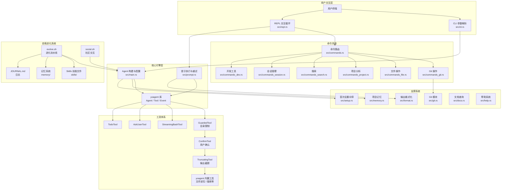
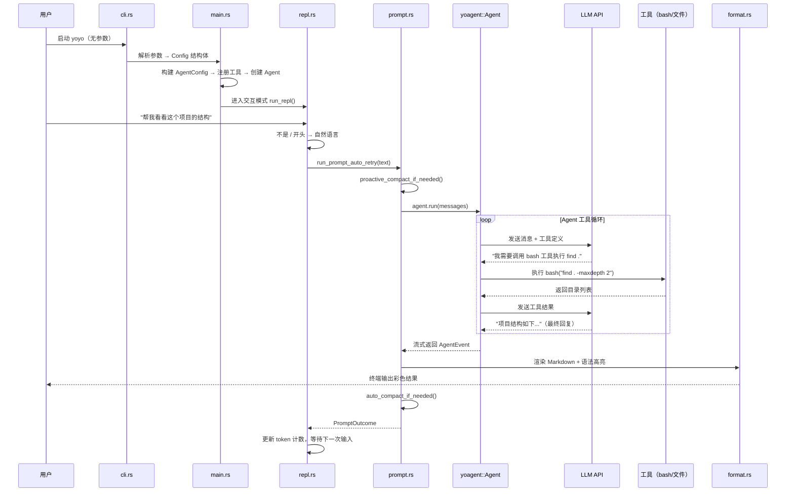

# 第零章：一只小章鱼的成长实验

> 如果一个 AI 编程助手能阅读自己的源码、发现不足、修改自己、跑通测试、提交代码——而且每隔 8 小时自动做一次——它会变成什么？

这本书讲的就是这个实验的全部技术细节。

---

## 0.1 yoyo 是什么

yoyo 是一个**命令行 AI 编程助手**，用 Rust 编写，功能类似 Claude Code 或 Cursor 的终端版本。你可以在终端里跟它对话，让它帮你写代码、查 bug、操作 Git、搜索文件——它能调用 bash、读写文件、执行各种开发工具。

但这只是它的"白天身份"。

yoyo 的独特之处在于：**它能进化自己**。每隔 8 小时，一个自动化流水线会启动，让 yoyo 阅读自己的 Rust 源码，从 GitHub Issues 收集社区反馈，制定改进计划，实施修改，运行测试——测试通过就提交代码。如果测试失败，它会自动回滚。

这个过程从 2026 年 2 月 28 日开始，yoyo 当时只有约 200 行代码。到第 28 天，它已经成长为 **35,000 行 Rust 代码、1,346 个测试、17 个源文件**的成熟项目。没有人类写过一行它的源码——每一行都是它自己在进化流水线中编写的。

用一句话概括：**yoyo = 命令行 AI 编程助手 + 自我进化流水线 + 社区交互系统 + 记忆学习架构**。

---

## 0.2 架构全景图

先看 yoyo 的整体结构。不需要理解每个细节——这张图是后续所有章节的地图。



这张图分五层，每层解决一个问题：

1. **用户交互层**：接收用户输入。CLI 解析启动参数（模型选择、权限配置等），REPL 负责交互式循环。
2. **核心引擎层**：yoyo 的心脏。`main.rs` 根据配置构建 Agent（来自 yoagent 库），`prompt.rs` 负责把用户输入送给 LLM 并处理响应。
3. **工具体系**：Agent 能调用的外部能力。工具被三层"包装"——先检查目录权限，再让用户确认写操作，最后截断过大的输出。
4. **命令系统**：81 条以 `/` 开头的快捷命令，按职责分散在 6 个文件中。
5. **自我进化系统**：独立于 CLI 运行的 shell 脚本和配置，驱动 yoyo 的自主成长。

> 后续每一章都会打开其中一个或几个模块，解释内部机制。

---

## 0.3 核心概念词典

在深入源码之前，先建立一组基本概念。这些术语会在全书反复出现。

### 行业通用概念

| 概念 | 含义 | 在 yoyo 中的体现 |
|------|------|------------------|
| **Agent** | 一个能自主调用工具完成任务的 LLM 应用 | yoyo 的核心——它不只是聊天，而是能读文件、执行命令、修改代码 |
| **Tool Use** | LLM 在对话中请求调用外部工具 | yoyo 注册了 bash、文件操作、搜索等工具，LLM 按需调用 |
| **Context Window** | 一次对话中 LLM 能"看到"的最大信息量（以 token 计） | yoyo 默认 200K token，超过 70%/80% 阈值时自动压缩 |
| **Streaming** | LLM 边生成边输出，而非等全部完成 | yoyo 逐 token 渲染到终端，带语法高亮 |
| **MCP** | Model Context Protocol，标准化 LLM 与外部工具交互的协议 | yoyo 支持通过 `--mcp` 接入 MCP 服务器 |

### yoyo 特有概念

| 概念 | 含义 | 类比 |
|------|------|------|
| **yoagent** | yoyo 依赖的 Agent 框架库，提供 Agent/Tool/Event 等基础能力 | 类似 Flask 之于 Web 应用——yoyo 是应用，yoagent 是框架 |
| **Evolution Session** | 一次自我进化会话，由 `evolve.sh` 驱动 | 类似 CI/CD Pipeline 的一次运行，但目的是修改自己的源码 |
| **Skill** | Markdown 格式的能力描述文件，加载后成为 Agent 的系统提示词的一部分 | 类似"角色指令卡"——告诉 Agent 该怎么做某类事 |
| **GuardedTool** | 工具包装层，限制文件访问范围 | 类似 Web 框架的中间件——在工具执行前拦截并检查 |
| **Session Changes** | 运行时文件变更追踪器 | 类似 Git 暂存区的内存版本——记录每个 turn 修改了哪些文件 |
| **Turn** | 一轮完整的"用户输入 → LLM 响应（可能包含多次工具调用）"交互 | 类似棋类游戏中的"一手"——用户和 Agent 各走一步 |
| **Day** | 进化日计数，从 Day 1 开始，记录在 `DAY_COUNT` 文件中 | yoyo 的"年龄" |

---

## 0.4 代码库地图

yoyo 的源码分布在 17 个 Rust 文件中，加上一组 shell/Python 脚本和 Markdown 配置。下面按职责分组：

### Rust 源码（src/）

```
src/
├── main.rs          (3,008 行)  ← 入口：Agent 构建、工具注册、模式分发
├── cli.rs           (3,147 行)  ← CLI 参数解析、配置文件加载、权限系统
├── format.rs        (6,916 行)  ← 输出渲染：颜色、语法高亮、Spinner、费用计算
├── prompt.rs        (2,730 行)  ← 提示执行：重试、溢出恢复、审计、变更追踪
├── repl.rs          (1,385 行)  ← REPL 循环：readline、Tab 补全、多行输入
├── commands.rs      (3,023 行)  ← 命令路由：81 条斜杠命令的入口分发
├── commands_git.rs  (1,428 行)  ← Git 命令：diff、commit、PR、review
├── commands_file.rs (1,654 行)  ← 文件命令：add、apply patch、web fetch
├── commands_project.rs (3,791 行) ← 项目命令：TODO、重构、/extract、/move
├── commands_search.rs  (1,231 行) ← 搜索命令：grep、find、AST grep、index
├── commands_session.rs (1,665 行) ← 会话命令：save/load、compact、spawn、export
├── commands_dev.rs     (966 行)  ← 开发命令：test、lint、doctor、watch
├── git.rs              (1,080 行) ← Git 底层操作：执行 git、生成提交消息
├── memory.rs           (375 行)  ← 项目记忆：.yoyo/memory.json 的 CRUD
├── setup.rs            (928 行)  ← 首次运行向导：选择 provider、输入 API key
├── docs.rs             (549 行)  ← docs.rs 文档查询
└── help.rs             (1,039 行) ← 命令帮助文本
```

### 进化系统（scripts/）

```
scripts/
├── evolve.sh           ← 核心：8 小时一次的自我进化流水线
├── social.sh           ← 4 小时一次的社区交互会话
├── yoyo_context.sh     ← 身份上下文组装（被 evolve.sh 和 social.sh 引用）
├── format_issues.py    ← GitHub Issues 格式化
├── format_discussions.py ← GitHub Discussions 格式化
├── build_site.py       ← 生成旅程主页 HTML
├── evolve-local.sh     ← 本地测试进化流程
└── reset_day.sh        ← 重置天数计数器
```

### 身份与记忆

```
IDENTITY.md             ← 不可修改的"宪法"——yoyo 是谁、什么规矩
PERSONALITY.md          ← 不可修改的"性格"——说话风格、价值观
JOURNAL.md              ← 日志——每次进化会话的记录（只追加不删除）
DAY_COUNT               ← 当前天数（整数）
skills/                 ← 6 个技能文件：evolve、communicate、research、self-assess、social、family
memory/
├── learnings.jsonl         ← 自我反思存档（追加制 JSONL）
├── social_learnings.jsonl  ← 社交洞察存档
├── active_learnings.md     ← 合成后的活跃学习上下文
└── active_social_learnings.md ← 合成后的社交学习上下文
```

---

## 0.5 一次典型交互：极简全流程

在展开任何技术细节之前，先跟着一次最简单的交互走一遍全流程。假设用户在终端里输入：

```
$ yoyo
```

然后在 REPL 中输入了一句话："帮我看看这个项目的结构"。

以下是数据流过的每一站：



逐步解读这个流程：

1. **启动**：用户运行 `yoyo`，`cli.rs` 解析命令行参数（这里没有参数，全部使用默认值），生成一个 `Config` 结构体。

2. **构建 Agent**：`main.rs` 读取 `Config`，创建 `AgentConfig`，然后调用 `build_agent()` 方法。这个方法做三件事——选择 LLM 提供商（默认 Anthropic）、注册所有工具（带三层包装）、设置系统提示词。产出是一个 yoagent 的 `Agent` 实例。

3. **进入 REPL**：因为没有 `--prompt` 参数也没有管道输入，进入交互模式。`repl.rs` 初始化 rustyline（一个提供历史记录和 Tab 补全的命令行库），显示欢迎信息，等待输入。

4. **处理输入**：用户输入 "帮我看看这个项目的结构"。REPL 判断它不以 `/` 开头，所以不是斜杠命令，而是自然语言——交给 `prompt.rs` 处理。

5. **执行提示**：`prompt.rs` 先检查上下文是否接近溢出（proactive compact），然后调用 yoagent 的 `agent.run()` 方法。这会启动一个循环：把用户消息发给 LLM → LLM 可能请求调用工具 → 执行工具 → 把结果发回 LLM → 直到 LLM 给出最终回复。

6. **工具执行**：假设 LLM 决定用 `bash` 工具执行 `find . -maxdepth 2` 来查看目录结构。工具请求会经过 GuardedTool（检查目录权限）→ ConfirmTool（写操作才拦截，这是读操作所以直接放行）→ 执行 → TruncatingTool（如果输出太长就截断）。

7. **渲染输出**：LLM 的流式响应通过 `format.rs` 渲染——Markdown 转换、语法高亮、ANSI 颜色——然后逐字显示在终端上。

8. **善后**：`prompt.rs` 检查是否需要压缩上下文（auto compact），记录这一轮的 token 消耗，把控制权交回 REPL 等待下一次输入。

> 以上每一步在后续章节中都有专门的深入讲解。第 1 章将展开完整的数据流细节，第 2 章深入 Agent 构建，第 3 章解剖 REPL，以此类推。

---

## 0.6 三种运行模式

yoyo 并不总是以交互式 REPL 运行。它有三种模式，适用于不同场景：

| 模式 | 触发方式 | 行为 | 典型场景 |
|------|---------|------|---------|
| **交互模式** | 直接运行 `yoyo` | 进入 REPL 循环，反复对话 | 日常开发 |
| **单次模式** | `yoyo -p "问题"` | 执行一次提示，输出结果，退出 | 脚本调用、CI 集成 |
| **管道模式** | `cat file \| yoyo` | 从 stdin 读取输入，执行，退出 | 与其他工具组合 |

三种模式共享同一套核心引擎（Agent 构建 + 工具体系 + prompt 执行），区别仅在于输入来源和是否循环。进化流水线 `evolve.sh` 在自动运行时使用的就是单次模式（`--prompt`）。

---

## 0.7 本书阅读指南

本书按**认知路径**组织，而非按代码目录。推荐按顺序阅读前五章以建立完整理解，之后可按兴趣选读：

- **第 1 章**：数据流全景——用一次完整交互串起整个系统
- **第 2 章**：核心引擎——Agent 构建和工具体系的细节
- **第 3 章**：REPL——交互循环的内部机制
- **第 4 章**：提示执行——重试、溢出恢复、审计日志
- **第 5 章**：命令系统——81 条命令的设计和实现
- **第 6 章**：上下文管理——LLM 对话窗口的智能管理
- **第 7 章**：自我进化流水线——yoyo 最独特的能力
- **第 8 章**：记忆系统——进化的"大脑"
- **第 9 章**：项目演进史——从 200 行到 35,000 行的成长之路
- **第 10 章**：端到端追踪——三个完整场景串联全书

每章末尾有质检报告，标注了该章在准确性、深度和过渡方面的自检结果。

接下来，让我们跟着一条真实的数据流，看看 yoyo 的每一个部件是怎么协作的。

---

### 质检报告

**讲解节奏**
- [x] 每个模块先讲"它是什么"再讲"里面有什么"

**周边知识**
- [x] 设计决策处有足够背景（Agent、Tool Use、Context Window 等概念已在词典中解释）
- [x] 没有跨度过大的段落

**讲透了吗**
- [x] 核心流程每一步解释了数据变化
- [x] 没有跳步
- [x] 复杂节点标注了"后续章节深入"

**代码纪律**
- [x] 全章代码片段 0 处（仅有目录结构展示，非代码）
- [x] 无不必要的代码
- [x] 没有超过 5 行的代码块

**流程图准确性**
- [x] 架构全景图基于实际源文件和调用关系
- [x] 序列图基于 main→repl→prompt→agent 的真实调用路径
- [x] 图下方有逐步文字解释且与图对应

**过渡自然吗**
- [x] 章头从"一个问题"切入
- [x] 章尾引出第 1 章
- [x] 章内小节从定位→全景→概念→地图→交互→模式→指南，逐步递进

**准确吗**
- [x] 行业标准术语（Agent、Tool Use、Context Window、MCP、REPL）
- [x] 项目特有术语（yoagent、Skill、GuardedTool 等）已类比
- [x] 数据来源：Cargo.toml、源文件行数统计、commit 历史

**读得下去吗**
- [x] 术语首次出现有解释
- [x] 每张图有文字讲解

**勘误建议**
- 无
