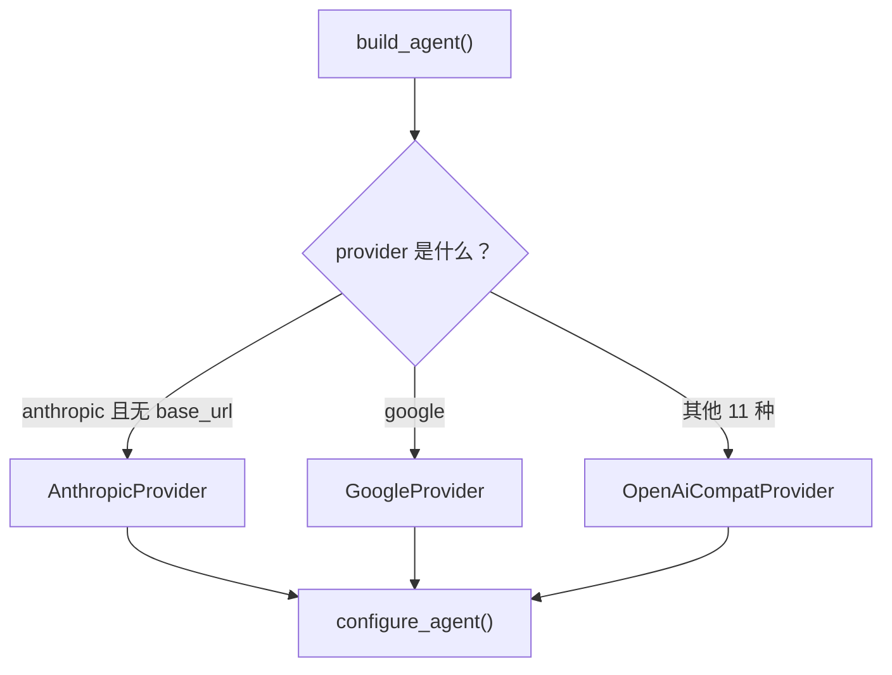
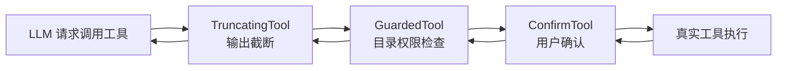
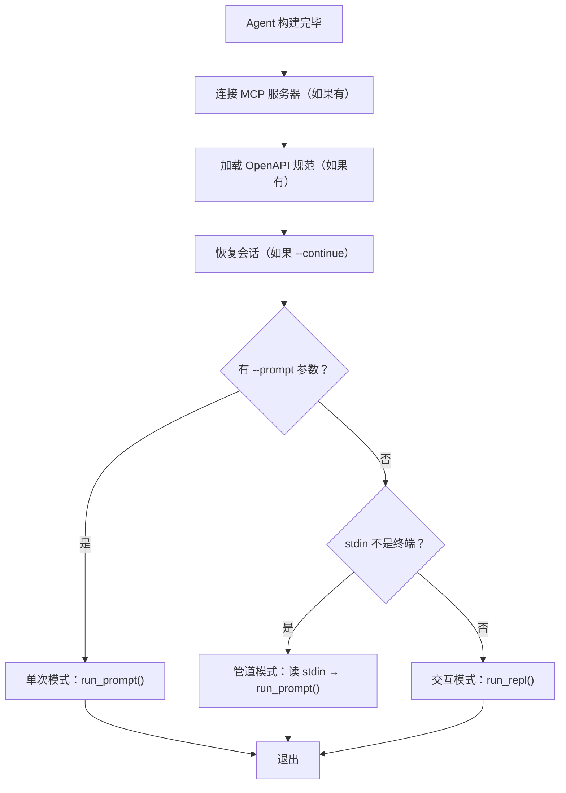
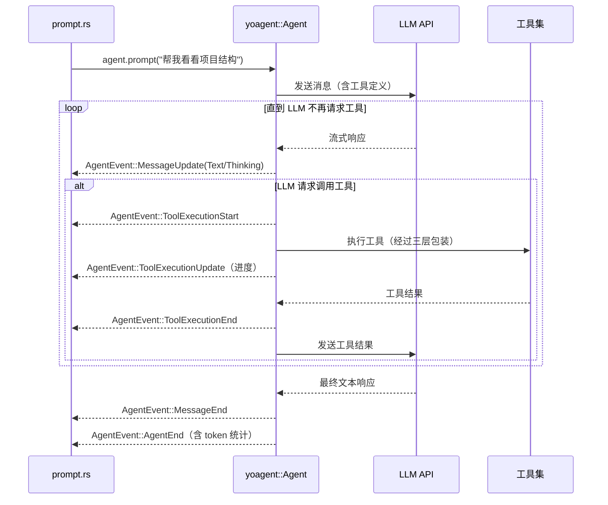

# 第一章：数据流全景 — 一次完整交互的旅程

序言中我们用一张简图勾勒了 yoyo 处理一次用户输入的全流程。这一章，我们要把那张图放大到每一个细节：数据在每一站的形态是什么、发生了什么变化、为什么要这样设计。

读完这一章，你会对 yoyo 从启动到响应的完整路径有清晰的认知。后续章节再打开各个"黑盒"时，你不会迷路。

---

## 1.1 启动：从命令行到 Config 结构体

当用户在终端输入 `yoyo --model claude-sonnet-4 --thinking high` 并回车，操作系统启动二进制，控制权进入 `main()` 函数。

`main()` 做的第一件事不是解析参数——而是检查两个全局开关：

```
main()
  — 检查 --no-color（在参数列表中扫描字符串，不走完整解析器）
  — 检查 --no-bell（同上）
  — 调用 parse_args() → Option<Config>
```

为什么要在解析之前检查这两个标志？因为颜色和声音影响**所有后续输出**——包括解析失败时的错误信息。如果等到完整解析后才禁用颜色，用户可能看到带 ANSI 转义码的乱码。这是一个典型的"启动顺序"问题。

`parse_args()` 位于 `src/cli.rs`，它遍历命令行参数，按照多层优先级组装 `Config` 结构体：

**优先级规则：CLI 参数 > 配置文件 > 环境变量 > 默认值**

以 `model` 字段为例：
1. 用户传了 `--model claude-sonnet-4` → 使用它
2. 没传？读 `.yoyo.toml` 或 `~/.config/yoyo/config.toml` 中的 `model` 字段
3. 配置文件也没有？根据 provider 选默认模型（Anthropic 默认 `claude-sonnet-4-20250514`）

API key 的查找更复杂：先看 `--api-key` 参数 → 再看 provider 对应的环境变量（比如 `OPENAI_API_KEY`）→ 再看通用的 `ANTHROPIC_API_KEY` 和 `API_KEY` → 最后看配置文件。

`parse_args()` 最终返回 `Option<Config>`。如果用户只是请求帮助（`--help`）或版本信息（`--version`），直接打印并返回 `None`，`main()` 立即退出。

---

## 1.2 构建 Agent：从 Config 到可用的 Agent 实例

Config 只是一袋配置值。要让 yoyo 真正能工作，需要把这些配置"实例化"为一个 `Agent` 对象——它封装了 LLM 连接、工具集合、系统提示词、上下文管理策略等一切运行时状态。

这个过程分两步：先创建 `AgentConfig`（yoyo 自己的配置结构），再调用 `build_agent()` 构建 yoagent 框架的 `Agent` 实例。

```
Config（CLI 解析结果）
  → AgentConfig（yoyo 的中间配置层）
    → Agent（yoagent 框架的核心对象）
```

为什么需要 `AgentConfig` 这个中间层？因为 `Config` 是 CLI 的产物，包含了很多与 Agent 无关的信息（比如 `output_path`、`verbose`）。`AgentConfig` 只保留构建 Agent 所需的字段，并且把它们组织成适合链式调用的形式。

### build_agent() 的决策树

`build_agent()` 根据 provider 字段走三条路径：



三条路径的区别仅在于创建的 Provider 类型不同。Anthropic 和 Google 有专用 Provider（因为它们的 API 格式与 OpenAI 不同），其余 11 种（openai、openrouter、ollama、xai、groq、deepseek、mistral、cerebras、zai、minimax、custom）都使用 OpenAI 兼容格式。

这是一个务实的设计决策：LLM 行业的现状是，大多数提供商都兼容 OpenAI 的 API 格式（请求/响应的 JSON 结构相同），只有少数几家有自己独特的格式。yoagent 框架为此提供了 `OpenAiCompatProvider` 作为通用适配器。

### configure_agent() 的链式装配

无论走哪条路径，最终都调用 `configure_agent()`。这个方法通过链式调用（builder pattern）把所有组件装配到 Agent 上：

```
configure_agent(agent)
  — .with_system_prompt(system_prompt)    ← 系统提示词
  — .with_model(model)                    ← 模型名称
  — .with_api_key(api_key)                ← API 密钥
  — .with_thinking(thinking_level)        ← 思考模式（off/low/high等）
  — .with_skills(skills)                  ← 技能文件集合
  — .with_tools(build_tools())            ← 工具集（详见下节）
  — .with_sub_agent()                     ← 子代理工具
  — .with_context_config(80% of window)   ← 上下文管理配置
  — .with_execution_limits(max_turns=200) ← 执行限制
  — .with_max_tokens(max_tokens)          ← 单次响应最大 token 数
  — set temperature                       ← 温度参数
```

注意上下文配置传入的是 context_window 的 80%——这给了自动压缩一个缓冲区。yoagent 框架在 token 使用量达到这个值时会触发内置的压缩策略。

如果用户选择了 `checkpoint` 模式（而非默认的 `compaction` 模式），还会注册一个 `on_before_turn` 回调：在每轮交互开始前检查 token 使用量，如果超过 70% 就设置全局标志 `CHECKPOINT_TRIGGERED`，让 `main()` 以退出码 2 结束。这让外部调度器（比如 evolve.sh）知道需要启动新进程继续。

---

## 1.3 工具体系：三层包装的设计

Agent 能调用的"工具"（Tool）是 yoyo 能力的核心来源。没有工具，Agent 只是一个聊天机器人；有了工具，它能读写文件、执行命令、搜索代码。

yoyo 注册的工具分两类：

**来自 yoagent 框架的内置工具**：
- `ReadFileTool`：读取文件内容
- `WriteFileTool`：写入文件
- `EditFileTool`：编辑文件（基于搜索替换）
- `ListFilesTool`：列出目录内容
- `SearchTool`：在文件中搜索文本

**yoyo 自己实现的工具**：
- `StreamingBashTool`：执行 bash 命令（带实时输出流）
- `AskUserTool`：向用户提问（仅交互模式可用）
- `TodoTool`：管理待办事项

但这些工具不是直接注册给 Agent 的。它们要经过最多三层"包装"（wrapping），每层解决一个安全或体验问题：



**第一层：TruncatingTool**——包裹所有工具。LLM 的上下文窗口有限，如果一个 `bash` 命令输出了 100KB 的日志，全部返回给 LLM 会浪费大量 token 甚至导致溢出。`TruncatingTool` 把输出限制在 30,000 字符（交互模式）或 15,000 字符（管道模式），超出的部分用省略号替代。

**第二层：GuardedTool**——仅当配置了目录限制时添加。它拦截工具参数中的 `path` 字段，检查目标路径是否在允许的目录范围内。比如 `--allow-dir ./src --deny-dir ./secrets` 会限制工具只能访问 `src/` 下的文件，绝不能碰 `secrets/`。

**第三层：ConfirmTool**——仅包裹写操作工具（write_file、edit_file），且仅在非自动批准模式下生效。它在执行前向用户展示将要修改的文件路径，等待用户输入 y/n。这是防止 LLM "失控"修改重要文件的最后一道防线。

不是每个工具都需要所有三层：

| 工具 | TruncatingTool | GuardedTool | ConfirmTool |
|------|:-:|:-:|:-:|
| bash | ✓ | — | — |
| read_file | ✓ | ✓ | — |
| write_file | ✓ | ✓ | ✓ |
| edit_file | ✓ | ✓ | ✓ |
| list_files | ✓ | ✓ | — |
| search | ✓ | ✓ | — |
| ask_user | — | — | — |
| todo | — | — | — |

`AskUserTool` 和 `TodoTool` 不需要任何包装——前者只是向用户提问，后者只操作内存中的列表，都没有文件系统副作用。

---

## 1.4 模式分发：三条路径的分岔口

Agent 构建完毕后，`main()` 来到一个三选一的分岔口。判断依据是**用户输入来自哪里**：



在进入三条路径之前，还有三个可选步骤：

1. **MCP 服务器连接**：如果用户传了 `--mcp "command args"`，yoyo 会启动指定的 MCP 服务器进程，通过 stdio 通信，获取服务器提供的额外工具。
2. **OpenAPI 规范加载**：如果传了 `--openapi file.yaml`，yoyo 会解析 OpenAPI 文件，把其中定义的 API 端点注册为可调用的工具。
3. **会话恢复**：如果传了 `--continue`，从 `.yoyo/last-session.json` 恢复上次对话的消息历史。

三条路径的核心差异：

| 特性 | 单次模式 | 管道模式 | 交互模式 |
|------|---------|---------|---------|
| 输入来源 | `--prompt` 参数 | stdin | 键盘（rustyline） |
| 循环 | 一次 | 一次 | 持续 |
| 斜杠命令 | 不支持 | 不支持 | 支持 |
| 用户确认 | 自动批准 | 自动批准 | 需要确认 |
| 输出截断阈值 | 15,000 字符 | 15,000 字符 | 30,000 字符 |
| 退出码 | 0 或 2（checkpoint） | 0 或 2 | 0 |

单次模式和管道模式都直接调用 `run_prompt()` 后退出。交互模式进入 `run_repl()`——一个循环，每轮处理一次用户输入。

---

## 1.5 REPL 循环：输入路由

交互模式是 yoyo 最常用的运行方式。`run_repl()` 的核心是一个无限循环：

```
run_repl() 循环：
  1. 显示提示符（包含 git 分支名，如 "yoyo (main) >"）
  2. readline() 读取一行输入
  3. 处理多行续行（反斜杠 \ 或未闭合的代码围栏）
  4. 判断输入类型：
     — 以 / 开头 → 斜杠命令 → 路由到对应 handler
     — 否则 → 自然语言 → run_prompt_auto_retry()
  5. 更新 token 统计、历史记录
  6. 回到步骤 1
```

斜杠命令的路由是一个大型 match/if-else 链，分发到不同文件中的处理函数。例如 `/commit` 路由到 `commands_git.rs::handle_commit()`，`/add` 路由到 `commands_file.rs::handle_add()`。

自然语言输入走完全不同的路径——进入 prompt 执行系统。这是下一节的主题。

> REPL 的详细机制（Tab 补全、多行输入、状态管理）在第 3 章深入讲解。

---

## 1.6 提示执行：从文本到 LLM 响应

用户输入 "帮我看看这个项目的结构" 后，REPL 调用 `run_prompt_auto_retry()`。这个函数的调用链有四层，每层添加一项能力：

```
run_prompt_auto_retry(input)
  — 能力：自动重试工具错误（最多 2 次）
  → run_prompt_with_changes(input, ...)
      — 能力：文件变更追踪 + 预防性压缩
      → run_prompt_once(input)
          — 能力：API 错误重试（最多 3 次，指数退避）
          → agent.prompt(input) → handle_prompt_events()
              — 能力：事件流处理 + 渲染
```

每层解决一类问题：

**最内层：handle_prompt_events()**——处理 yoagent 的事件流。`agent.prompt()` 返回一个异步 channel，yoyo 从中逐个接收事件并做出反应。

**第二层：run_prompt_once()**——处理 API 级别的错误。如果 LLM API 返回 429（频率限制）、5xx（服务器错误）或网络超时，等待 1 秒后重试，最多 3 次，每次等待时间翻倍（指数退避：1s → 2s → 4s）。

**第三层：run_prompt_with_changes()**——在执行前做预防性压缩（如果上下文已用 70% 以上），在执行后做常规压缩（80% 以上）。同时追踪这一轮修改了哪些文件（用于 `/undo` 功能）。

**最外层：run_prompt_auto_retry()**——如果 LLM 调用了一个工具但工具执行失败（比如 bash 命令报错），自动把错误信息作为上下文重新提交给 LLM，让它自行修正。最多重试 2 次。

### 事件流：Agent 内部发生了什么

当 `agent.prompt()` 被调用后，yoagent 框架开始了一个循环：



yoyo 在 `handle_prompt_events()` 中处理这些事件。不同事件触发不同的 UI 行为：

| 事件 | yoyo 的响应 |
|------|------------|
| `ToolExecutionStart` | 显示工具名和参数摘要（如 "⚙ bash: find . -maxdepth 2"），启动计时 |
| `ToolExecutionUpdate` | 仅在交互模式下显示工具的部分输出（实时流） |
| `ToolExecutionEnd` | 显示 ✓/✗ 和耗时，记录到审计日志 |
| `MessageUpdate::Text` | 增量渲染 Markdown（语法高亮、代码块着色） |
| `MessageUpdate::Thinking` | 以暗色显示思考过程（发送到 stderr） |
| `MessageEnd` | 刷新渲染缓冲区 |
| `AgentEnd` | 汇总 token 使用量和费用 |

---

## 1.7 渲染：从纯文本到彩色终端

LLM 的响应是纯文本（可能包含 Markdown 格式）。yoyo 的 `format.rs`（整个项目最大的文件，6,916 行）负责把这些文本转换为美观的终端输出。

渲染涉及几个层面：

1. **Markdown 处理**：识别标题、列表、代码块、加粗/斜体，转换为对应的 ANSI 格式。
2. **语法高亮**：代码块中的关键字（如 `fn`、`let`、`if`）用不同颜色标注。yoyo 内置了一个基于关键字的高亮引擎，支持 Rust、Python、JavaScript 等语言。
3. **增量渲染**：LLM 的响应是流式的（一次几个 token），yoyo 需要在不完整的输出上做渲染。这要处理一些棘手的边界情况——比如一个代码围栏 ` ``` ` 可能分两次 token 到达。
4. **颜色系统**：所有颜色输出都通过 `Color` 结构体，它会检查 `NO_COLOR` 环境变量和 `--no-color` 标志。如果颜色被禁用，所有 ANSI 转义码变为空字符串。
5. **Spinner**：在等待 LLM 响应时显示旋转动画（⠋⠙⠹⠸⠼⠴⠦⠧⠇⠏），收到第一个 token 后消失。

> format.rs 的详细设计不在本章深入。后续章节在讨论具体功能时会按需展开渲染细节。

---

## 1.8 善后：压缩、统计与等待

一次交互完成后，prompt 系统做三件善后工作：

1. **上下文压缩检查**：如果 token 使用量超过上下文窗口的 80%，自动触发压缩。压缩是让 LLM 把长对话摘要为更短的版本，腾出空间。这是 yoagent 框架提供的能力。

2. **使用量统计**：打印这一轮消耗的 token 数（输入 + 输出）、累计 session 总量、估算费用。格式如 `↳ 1.2K in / 0.8K out · session: 15.3K · ~$0.02`。

3. **铃声通知**：如果这一轮耗时超过 3 秒，发一个终端铃声（`\x07`），提醒已经切走的用户。可以通过 `--no-bell` 或 `YOYO_NO_BELL` 禁用。

控制权回到 REPL 循环，显示提示符，等待下一次输入。

---

## 1.9 数据形态总结

让我们回顾一次完整交互中，数据在每一站的形态变化：

| 阶段 | 数据形态 | 关键变化 |
|------|---------|---------|
| 命令行参数 | `Vec<String>` | 原始字符串列表 |
| parse_args() 之后 | `Config` 结构体 | 多层优先级合并为单一配置 |
| build_agent() 之后 | `Agent` 实例 | 配置实例化为运行时对象，工具已注册 |
| REPL readline() | `String` | 一行用户输入 |
| 多行处理后 | `String` | 可能合并了多行 |
| run_prompt() 入口 | `&str` + `&mut Agent` | 文本 + Agent 引用 |
| agent.prompt() 内部 | HTTP 请求体（JSON） | 消息数组 + 工具定义 + 模型参数 |
| LLM 响应 | 流式 SSE 事件 | 增量 token 文本 + 可能的工具调用请求 |
| 工具执行 | 工具参数 → 工具输出 | JSON 参数经三层包装后执行，输出可能被截断 |
| 事件处理 | `AgentEvent` 枚举 | 分类为文本/工具/状态事件 |
| 渲染输出 | ANSI 彩色文本 | Markdown → 终端格式 |
| 善后 | token 计数、费用估算 | 累加到 session 总量 |

这就是 yoyo 处理一次交互的完整数据流。现在你已经有了全局地图——接下来，我们要打开这条路径上最核心的"黑盒"：Agent 是怎么构建的、工具体系内部如何运转。

---

### 质检报告

**讲解节奏**
- [x] 每个模块先讲"它是什么"再讲"里面有什么"

**周边知识**
- [x] 指数退避、Builder Pattern、SSE 等概念在使用处有足够解释
- [x] 工具包装层的设计动机（安全、token 节省）有交代

**讲透了吗**
- [x] 核心流程每一步解释了数据变化（1.9 节表格总结）
- [x] 没有跳步——从 main() 到渲染到善后完整覆盖
- [x] 复杂节点标注了"详见第 N 章"（REPL → 第 3 章，format.rs → 后续按需展开）

**代码纪律**
- [x] 全章代码片段 0 处（全部用调用路径和文字描述）
- [x] 没有超过 5 行的代码块

**流程图准确性**
- [x] build_agent() 三分支基于源码确认（main.rs configure_agent 逻辑）
- [x] 事件流序列图基于 prompt.rs handle_prompt_events 中的事件处理
- [x] 模式分发图基于 main() 中的条件判断顺序
- [x] 图下方有逐步文字解释且与图对应

**过渡自然吗**
- [x] 章头承接序言的"简图"，承诺放大细节
- [x] 章尾引出第 2 章（Agent 构建和工具体系）
- [x] 章内从启动→构建→工具→路由→REPL→执行→渲染→善后，沿数据流自然推进

**准确吗**
- [x] 行业标准术语（Builder Pattern、指数退避、SSE、ANSI）
- [x] 项目特有术语沿用序言的定义
- [x] 数据来源：main.rs/cli.rs/prompt.rs/format.rs 源码

**读得下去吗**
- [x] 术语首次出现有解释
- [x] 每张图有文字讲解

**勘误建议**
- 无
