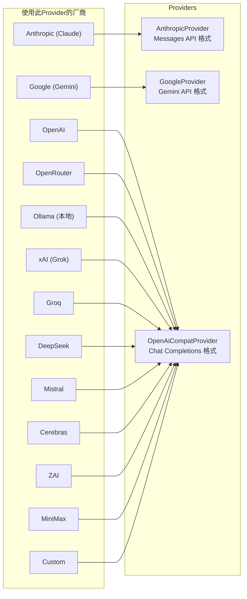
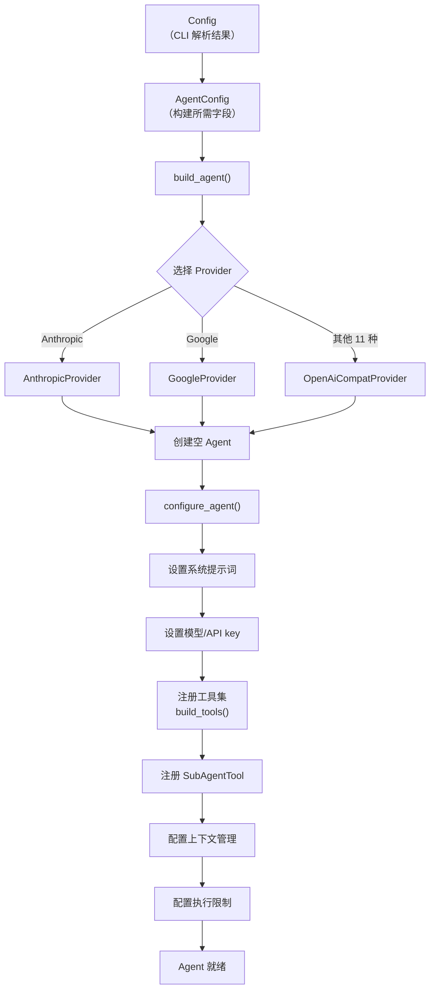

# 第二章：核心引擎 — Agent 构建与工具体系

上一章我们跟着数据流走了一遍全程，知道了 yoyo 在 `build_agent()` 中把配置变成了一个可工作的 Agent 实例，工具经过三层包装后注册。这一章，我们打开这两个黑盒，看清内部每一个齿轮是怎么咬合的。

---

## 2.1 yoagent：yoyo 脚下的框架

在讲 yoyo 的实现之前，有必要先理解它站在什么上面。

yoagent 是一个 Rust 编写的 Agent 框架库（类似 Python 世界中 LangChain 的极简版本）。它提供了构建 LLM Agent 所需的几个核心抽象：

| yoagent 提供的 | 解决什么问题 |
|---------------|-------------|
| `Agent` 结构体 | 管理对话状态、工具集、LLM 交互循环 |
| `AgentTool` trait | 定义工具的接口规范（名称、描述、参数 schema、执行） |
| `StreamProvider` trait | 抽象不同 LLM 提供商的 API 差异 |
| `AgentEvent` 枚举 | 标准化 Agent 执行过程中的各种事件（文本、工具调用、错误等） |
| `ContextConfig` | 上下文窗口管理策略 |
| `ExecutionLimits` | 执行约束（最大轮次、最大 token、超时） |
| `SubAgentTool` | 子代理委托机制 |
| `SkillSet` | Markdown 技能文件加载 |
| 内置工具集 | bash、文件读写、搜索、列目录等基础工具 |

yoyo 的角色是：**在 yoagent 提供的骨架上，构建一个完整的、有个性的编程助手。** 具体来说，yoyo 做了三件 yoagent 没有做的事：

1. **安全层**：目录限制、用户确认、输出截断——yoagent 的工具是"裸"的，yoyo 给它们穿上了防护服。
2. **交互体验**：REPL、Tab 补全、81 条斜杠命令、Markdown 渲染、语法高亮——这些全是 yoyo 自己的。
3. **自我进化**：技能文件、记忆系统、进化流水线——yoagent 对此一无所知。

理解了这个分工，后面讲到 yoyo 的具体实现时，你就能分辨哪些是框架能力、哪些是 yoyo 的独创。

---

## 2.2 AgentConfig：配置的中间层

第 1 章提到，`Config`（CLI 解析结果）不直接用来构建 Agent，而是先转化为 `AgentConfig`。这个中间层存在的理由是**关注点分离**：`Config` 包含一切命令行信息（包括 `output_path`、`verbose` 等与 Agent 无关的字段），`AgentConfig` 只保留构建 Agent 所需的参数。

`AgentConfig` 的关键字段及其用途：

| 字段 | 类型 | 驱动什么 |
|------|------|---------|
| `model` | String | 决定调用哪个 LLM 模型 |
| `api_key` | String | LLM API 认证 |
| `provider` | String | 选择 Provider 实现（anthropic/google/openai-compat） |
| `base_url` | Option | 自定义 API 端点（用于 ollama 等本地模型） |
| `skills` | SkillSet | 加载的技能文件集合 |
| `system_prompt` | String | Agent 的系统提示词 |
| `thinking` | ThinkingLevel | LLM 思考模式（off/low/medium/high） |
| `max_turns` | usize | 单次交互最大工具调用轮次 |
| `auto_approve` | bool | 是否跳过写操作确认 |
| `permissions` | PermissionConfig | bash 命令的允许/拒绝模式匹配 |
| `dir_restrictions` | DirectoryRestrictions | 文件工具的目录白名单/黑名单 |
| `context_strategy` | ContextStrategy | 上下文管理策略（压缩 vs 检查点） |
| `context_window` | Option | 覆盖默认上下文窗口大小 |

`AgentConfig` 提供两个核心方法：`build_agent()` 创建新 Agent，`configure_agent()` 对已有 Agent 应用配置。这种分离让会话恢复（`--continue`）成为可能——恢复时不需要重新创建 Agent，只需重新配置。

---

## 2.3 Provider 选择：三条构建路径

`build_agent()` 的第一个决策是：用哪个 Provider 连接 LLM？

**为什么需要不同的 Provider？** 因为 LLM 厂商的 API 格式并不统一。虽然大多数厂商都追随了 OpenAI 的格式（请求 body 和响应 body 的 JSON 结构相同），但 Anthropic（Claude 系列）和 Google（Gemini 系列）有自己独特的格式。yoagent 为此提供了三种 Provider 实现：



13 个厂商中，11 个共享同一个 Provider。这体现了一个务实的工程决策：**适配所有 API 格式是不值得的——抓住 OpenAI 兼容格式这个事实标准，覆盖大多数场景。**

每个厂商通过 `ModelConfig` 传递自己的特殊配置（主要是 API 基地址和模型名称映射）。比如 `ModelConfig::ollama("http://localhost:11434", "llama3")` 和 `ModelConfig::deepseek("deepseek-chat")` 使用同一个 Provider，但 API 地址和模型名不同。

---

## 2.4 工具注册：build_tools() 的组装逻辑

Provider 确定后，`configure_agent()` 调用 `build_tools()` 组装工具集。这个函数是理解 yoyo 安全模型的关键。

### 共享的"永久批准"标志

`build_tools()` 第一行就创建了一个共享标志：

```
let always_approved = Arc<AtomicBool> 初始为 false
```

这个标志在 bash 工具和文件写入工具之间**共享**。当用户在任何一个工具的确认提示中选择 "always"（`a`），这个标志变为 `true`，之后**所有**工具都不再询问——不只是那一个工具。

为什么这样设计？因为用户在一个 Agent 会话中频繁确认是很烦人的。选择 "always" 意味着用户信任这个 Agent 在当前会话中的行为，这个信任应该对所有工具生效。

### bash 工具的特殊处理

bash 是唯一一个不使用三层包装模式的工具。它直接使用 yoyo 自己实现的 `StreamingBashTool`（而非 yoagent 内置的 `BashTool`），原因是 yoyo 需要**实时流式展示 bash 输出**——用户能看到命令一边执行一边产生结果，而不是等命令结束后才看到全部输出。

bash 的确认逻辑直接嵌入在工具内部（通过 `with_confirm()` 闭包），而不是通过 `ConfirmTool` 包装。确认流程：

```
bash 工具收到命令 "find . -maxdepth 2"
  → 检查 always_approved 标志 → 已批准 → 直接执行
  → 未批准 → 检查 PermissionConfig 模式匹配
    → 匹配 allow 模式 → 直接执行
    → 匹配 deny 模式 → 拒绝执行
    → 无匹配 → 显示 "⚠ Allow: find . -maxdepth 2 ? (y/n/always)"
      → 用户输入 y → 执行
      → 用户输入 a → 设置 always_approved=true → 执行
      → 用户输入 n → 拒绝执行
```

### 文件工具的包装顺序

文件工具的包装顺序很重要。以 `write_file` 为例，从内到外的包装是：

```
WriteFileTool（yoagent 原生）
  → ConfirmTool（用户确认，共享 always_approved 标志）
    → GuardedTool（目录权限检查）
      → TruncatingTool（输出截断）
```

执行时，请求从外向内穿透：先截断检查（对输出，不对输入）→ 目录权限检查 → 用户确认 → 实际写入。

为什么是这个顺序？因为 **GuardedTool 应该在 ConfirmTool 之前**——如果路径被目录规则禁止了，就没必要去问用户是否确认。先检查硬规则，再问用户，最后执行。TruncatingTool 在最外层因为它处理的是**输出**而非输入，放在哪里都行，但放在最外层能确保无论哪一层产生的错误消息都被截断。

### 完整的工具列表

`build_tools()` 最终返回一个 `Vec<Box<dyn AgentTool>>`，按以下顺序注册：

```
1. bash        → TruncatingTool(StreamingBashTool)
2. read_file   → TruncatingTool(GuardedTool(ReadFileTool))
3. write_file  → TruncatingTool(GuardedTool(ConfirmTool(WriteFileTool)))
4. edit_file   → TruncatingTool(GuardedTool(ConfirmTool(EditFileTool)))
5. list_files  → TruncatingTool(GuardedTool(ListFilesTool))
6. search      → TruncatingTool(GuardedTool(SearchTool))
7. rename_symbol → TruncatingTool(ConfirmTool(RenameSymbolTool))
8. ask_user    → AskUserTool（仅交互模式，无包装）
9. todo        → TodoTool（无包装）
```

外加通过 `with_sub_agent()` 单独注册的 `SubAgentTool`。

---

## 2.5 SubAgentTool：上下文隔离的委托

`SubAgentTool` 是一个特殊工具——它本身**内部包含一个独立的 Agent**。当父 Agent 决定把一个任务委托给子代理时，子代理在自己的上下文窗口中独立运行，完成后返回一个文本摘要给父 Agent。

这解决了一个实际问题：**复杂任务会消耗大量上下文空间。** 如果让父 Agent 自己做所有事，搜索文件、阅读代码、运行测试的中间结果会迅速填满上下文窗口。子代理在独立的上下文中工作，只把最终摘要传回，大幅减少了父 Agent 的上下文消耗。

子代理的构建（`build_sub_agent_tool()`）有几个值得注意的设计选择：

1. **简化的工具集**：子代理只有 6 个基础工具（bash、read_file、write_file、edit_file、list_files、search），没有确认提示、没有目录限制、没有 AskUser。因为委托本身已经是父 Agent 授权的行为。

2. **相同的 Provider**：子代理继承父 Agent 的 provider/model/api_key，确保使用同一个 LLM。

3. **独立的系统提示词**：子代理有自己的系统提示词——"You are a focused sub-agent. Complete the given task efficiently..."——不继承父 Agent 的系统提示词。

4. **无递归**：子代理没有自己的 `SubAgentTool`，不能再委托子子代理。这是刻意的限制，防止无限递归。

---

## 2.6 configure_agent() 的链式装配

工具准备好后，`configure_agent()` 通过链式调用把所有组件组装到 Agent 上。这个过程中有几个值得深入理解的决策：

### 上下文配置

```
agent.with_context_config(ContextConfig {
    max_tokens: 上下文窗口 × 80%,
    compaction_strategy: 由 yoagent 管理,
})
```

为什么传入 80% 而不是 100%？因为需要给"最后一轮"留空间。如果上下文已经用了 99%，下一轮的用户输入和 LLM 响应可能直接溢出。80% 是一个保守的缓冲——yoagent 在达到这个阈值时会自动压缩历史消息。

### 执行限制

```
agent.with_execution_limits(ExecutionLimits {
    max_turns: config.max_turns 或 200,
})
```

一个 "turn" 是 Agent 内部的一轮工具调用循环。上限 200 意味着 LLM 在一次用户提问中最多可以调用 200 次工具。这个数字足够处理复杂任务（比如搜索多个文件、修改代码、运行测试），同时防止死循环。

### Checkpoint 模式的回调

如果用户选择了 `--context-strategy checkpoint`，会注册一个 `on_before_turn` 回调：

```
每轮工具调用前：
  检查当前 token 使用量
  → 超过 70% → 设置 CHECKPOINT_TRIGGERED = true
  → Agent 停止执行
  → main() 以退出码 2 退出
```

这个机制是为进化流水线设计的。`evolve.sh` 可以检测退出码 2，知道 Agent 因为上下文不够而停止了，可以启动一个新进程继续执行剩余任务。相比自动压缩（会丢失对话细节），检查点模式完全保留所有信息——代价是需要外部调度器协调。

---

## 2.7 AskUserTool 与 TodoTool：yoyo 的自定义工具

除了对 yoagent 内置工具的包装，yoyo 还实现了两个完全自定义的工具。

### AskUserTool

这个工具让 LLM 能**主动向用户提问**。传统的 Agent 交互是单向的——用户提问，Agent 回答。但有些场景需要 Agent 确认需求，比如"你想修改哪个文件？"或"要用 React 还是 Vue？"

`AskUserTool` 的实现极其简单：收到 LLM 的问题文本 → 打印到终端 → 从 stdin 读取用户回答 → 返回给 LLM。它只在交互模式下注册（`stdin.is_terminal()` 检查），管道模式和单次模式下不可用——因为这些模式没有人在终端前等着回答问题。

### TodoTool

`TodoTool` 管理一个内存中的待办列表，支持 list、add、done、wip、remove、clear 六个操作。它的设计目标是让 Agent 在自主运行时（比如进化流水线中）能追踪自己的任务进度。

TodoTool 不涉及文件系统，数据只存在于进程内存中——进程退出后列表就消失了。这是刻意的设计：它是**会话级别**的任务追踪，不是持久化的 TODO 数据库。

---

## 2.8 总结：从配置到可工作的 Agent

让我们回顾这一章描述的完整组装过程：



最终产出的 `Agent` 实例拥有：
- 一个 LLM 连接（通过 Provider）
- 9 个注册工具（含三层安全包装）+ 1 个子代理工具
- 系统提示词（可能包含技能文件内容）
- 上下文管理策略
- 执行约束

它已经准备好接收用户输入并开始工作了。下一章，我们来看 REPL 如何驱动这个 Agent——从用户按下回车的那一刻起，到命令被路由到正确的处理函数。

---

### 质检报告

**讲解节奏**
- [x] yoagent 先讲"是什么"（框架库），再讲"提供什么"（具体抽象）
- [x] 每个包装层先讲"解决什么问题"，再讲"怎么实现"

**周边知识**
- [x] LLM API 格式差异（为什么需要三种 Provider）有交代
- [x] Arc<AtomicBool> 共享标志的设计动机有解释
- [x] 上下文管理 80% 阈值的原因有交代

**讲透了吗**
- [x] 工具包装的完整顺序和每层的作用
- [x] bash 确认流程的完整决策路径
- [x] SubAgentTool 的四个设计选择
- [x] 复杂节点（上下文管理细节）标注了"详见第 6 章"

**代码纪律**
- [x] 全章代码片段 0 处
- [x] 全部用调用路径、表格和文字描述

**流程图准确性**
- [x] Provider 选择图基于 build_agent() 源码三分支
- [x] 组装流程图基于 configure_agent() 的实际链式调用顺序
- [x] 工具列表和包装层基于 build_tools() 源码逐行验证

**过渡自然吗**
- [x] 章头承接第 1 章的"两个黑盒"
- [x] 章尾引出第 3 章（REPL 如何驱动 Agent）
- [x] 章内从框架→配置→Provider→工具→子代理→装配，逐步递进

**准确吗**
- [x] yoagent 的抽象（Agent、AgentTool、StreamProvider）与实际 API 一致
- [x] 工具包装顺序与 build_tools() 源码一致
- [x] SubAgentTool 构建细节与 build_sub_agent_tool() 一致

**读得下去吗**
- [x] 术语首次出现有解释
- [x] 每张图有文字讲解

**勘误建议**
- 无
