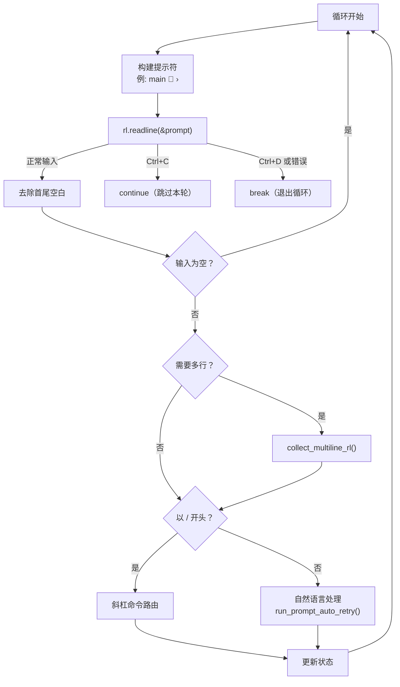
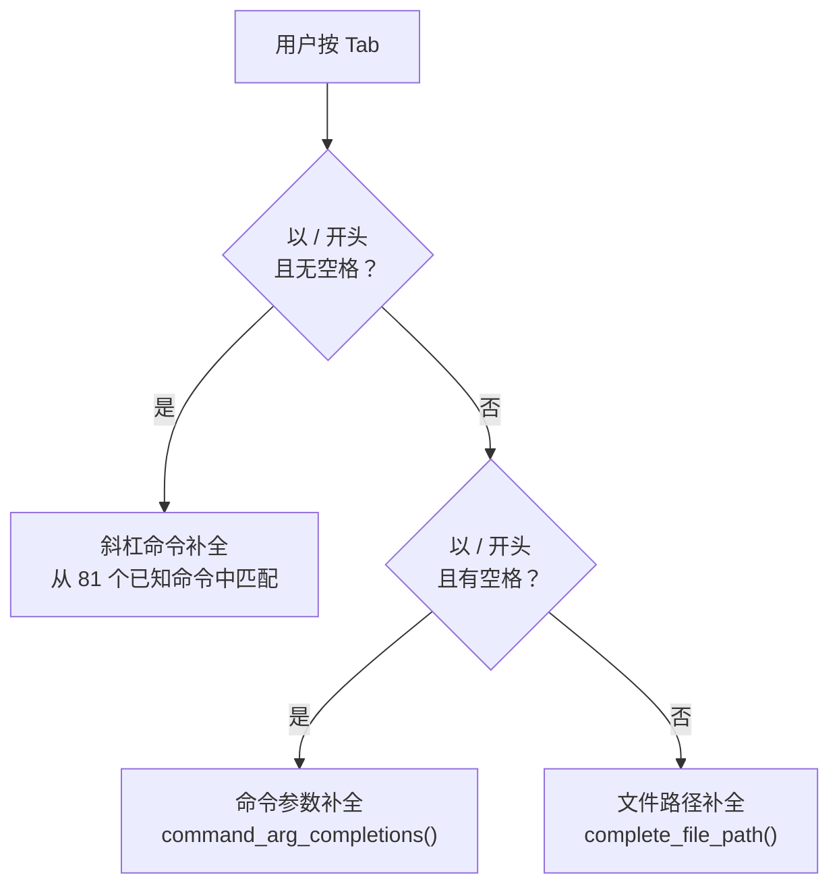

# 第三章：REPL 交互循环

Agent 构建完毕后，如果用户没有指定 `--prompt` 也没有管道输入，yoyo 进入交互模式——一个基于 rustyline 的 REPL 循环。这一章我们深入 `src/repl.rs` 和相关模块，看清从用户按下回车到输入被处理的每一步。

---

## 3.1 rustyline：命令行交互的基础库

在讲 yoyo 的 REPL 之前，需要了解它站在什么上面。

**rustyline** 是一个 Rust 的 readline 库（类似 GNU readline 或 Python 的 `readline` 模块）。它提供了交互式命令行的基础能力：

| 能力 | 说明 |
|------|------|
| 行编辑 | 光标移动、删除、Ctrl+A/E 跳到行首/尾 |
| 历史记录 | 上下箭头浏览历史、持久化到文件 |
| Tab 补全 | 自定义补全逻辑 |
| 信号处理 | Ctrl+C 中断、Ctrl+D 退出 |
| 多行输入 | 续行提示符 |

yoyo 使用 rustyline 15.x 版本，通过实现 `Helper` trait 来注入自定义的 Tab 补全逻辑。

---

## 3.2 REPL 初始化：Banner 与状态

`run_repl()` 函数接收 `AgentConfig`、`Agent`、以及几个计数器（MCP 服务器数、OpenAPI 规范数）。它做的第一件事是打印一个信息 banner：

```
run_repl() 初始化：
  — print_banner()：显示 yoyo 标识
  — 逐行打印当前配置（provider、model、thinking、skills 数量等）
  — 如果有上次会话且未用 --continue，提示用户可以恢复
  — 初始化 rustyline Editor，设置 YoyoHelper
  — 加载命令历史文件
  — 初始化会话状态：
    · session_total: Usage（累计 token 使用量）
    · last_input: Option<String>（上一次输入，用于 /retry）
    · bookmarks: HashMap<String, String>（会话书签）
    · session_changes: SessionChanges（文件变更追踪器）
    · turn_history: TurnHistory（撤销栈）
    · spawn_tracker: SpawnTracker（子代理任务追踪器）
```

这些状态变量贯穿整个 REPL 生命周期。特别值得注意的是 `turn_history`——它是一个栈结构，每一轮交互前保存文件快照，支持 `/undo` 命令回滚文件修改。详细机制在第 4 章（提示执行）中展开。

---

## 3.3 主循环：readline → 路由 → 处理

初始化完成后进入无限循环。每次迭代的流程：



### 提示符的 Git 感知

提示符不是固定的——它动态显示当前 Git 分支：

```
main 🐙 ›           ← 如果在 Git 仓库中
🐙 ›                 ← 如果不在 Git 仓库中
```

这通过 `git_branch()` 函数实现，它执行 `git rev-parse --abbrev-ref HEAD` 获取分支名。如果执行失败（不在 Git 仓库中），就省略分支部分。

### 多行输入

yoyo 支持两种多行输入方式：

1. **反斜杠续行**：行尾加 `\` 表示"这行没完"，REPL 显示 `...` 续行提示符，直到收到不以 `\` 结尾的行。
2. **代码围栏**：以 ` ``` ` 开头进入代码块模式，直到收到独立的 ` ``` ` 行。这让用户可以粘贴多行代码。

`needs_continuation()` 函数做判断，`collect_multiline_rl()` 负责收集。

---

## 3.4 Tab 补全：三层补全策略

`YoyoHelper` 实现了 rustyline 的 `Completer` trait，提供三层 Tab 补全。补全逻辑按优先级依次尝试：



**第一层：斜杠命令补全**。当用户输入 `/co` 然后按 Tab，从 `KNOWN_COMMANDS`（81 条命令的静态数组）中找所有以 `/co` 开头的候选项，如 `/commit`、`/compact`、`/config`、`/context`。

**第二层：命令参数补全**。当用户输入 `/model cl` 然后按 Tab，先识别出命令是 `/model`，再调用 `command_arg_completions()` 获取该命令的参数候选。不同命令有不同的参数候选——`/model` 补全模型名称，`/help` 补全命令名称，`/think` 补全 `off/minimal/low/medium/high`。

**第三层：文件路径补全**。如果不在斜杠命令上下文中，尝试文件路径补全。提取光标前最后一个空白字符后的词，把它当作文件路径前缀，列出目录内容进行匹配。目录名后自动追加 `/`，方便继续补全子路径。

---

## 3.5 命令路由：斜杠命令的分发

当输入以 `/` 开头时，REPL 把它视为斜杠命令，进入一个大型的 if-else 分发逻辑。命令被分发到 6 个处理文件中的具体函数：

```
用户输入: "/commit fix bug"

REPL 路由:
  — 提取命令名: "commit"
  — 提取参数: "fix bug"
  — 匹配到: /commit → commands_git::handle_commit(agent, "fix bug")
```

81 条命令按职责分散在不同文件中。大致分组：

| 分组 | 处理文件 | 典型命令 |
|------|---------|---------|
| 会话控制 | repl.rs（内联） | /quit, /exit, /clear, /retry |
| 状态查看 | commands.rs | /status, /tokens, /cost, /config, /model |
| Git 操作 | commands_git.rs | /commit, /diff, /git, /pr, /review, /undo |
| 文件操作 | commands_file.rs | /add, /apply, /web |
| 项目工具 | commands_project.rs | /init, /context, /docs, /extract, /move, /refactor |
| 搜索 | commands_search.rs | /find, /grep, /ast, /index |
| 会话管理 | commands_session.rs | /save, /load, /compact, /spawn, /export, /mark, /jump, /stash |
| 开发工具 | commands_dev.rs | /test, /lint, /doctor, /tree, /run, /fix, /watch |
| 记忆 | commands.rs | /remember, /memories, /forget |

某些简单命令直接在 REPL 循环内处理（如 `/quit` 就是 `break`，`/clear` 清空消息历史），不需要调用外部函数。

未知命令会触发提示："Unknown command: /xyz. Try /help for a list."

---

## 3.6 自然语言路径：进入 prompt 系统

当输入不以 `/` 开头时，REPL 把它视为自然语言，调用 prompt 系统处理：

```
REPL 自然语言路径:
  — 保存输入到 last_input（用于 /retry）
  — 记录交互前的文件快照（turn_history.push()）
  — 调用 run_prompt_auto_retry(input, agent, session_total, ...)
  — 取回 PromptOutcome（响应文本 + token 使用量 + 错误信息）
  — 累加 session_total
  — 检查是否需要运行 watch 命令
  — 加入历史记录
```

`run_prompt_auto_retry()` 是 prompt 系统的入口——它的内部机制是第 4 章的主题。从 REPL 的角度，它只关心返回值 `PromptOutcome`：

| PromptOutcome 字段 | 含义 |
|-------------------|------|
| `text` | LLM 最终的文本响应 |
| `last_tool_error` | 最后一个工具错误（如果有） |
| `was_overflow` | 是否因上下文溢出而终止 |

REPL 根据这些信息决定后续行为——比如如果 `was_overflow` 为 true，可能提示用户考虑压缩对话。

---

## 3.7 会话状态管理

REPL 维护的状态变量在整个会话中持续更新：

**session_total (Usage)**：累计所有 turn 的 token 使用量。每次 prompt 返回后累加。用于 `/tokens` 和 `/cost` 命令显示。

**last_input (Option<String>)**：保存最近一次的用户输入。`/retry` 命令直接重发这个输入。

**bookmarks (HashMap)**：会话书签——用户可以用 `/mark checkpoint1` 保存当前对话状态，之后用 `/jump checkpoint1` 回到那个点。内部保存的是消息历史的序列化快照。

**session_changes (SessionChanges)**：线程安全的文件变更列表。每当工具修改了文件（write_file、edit_file），路径和操作类型被记录在这里。`/changes` 命令显示这个列表。

**turn_history (TurnHistory)**：文件撤销栈。每轮交互前，把可能被修改的文件的当前内容保存下来。`/undo` 命令从栈中弹出最近一轮的快照并恢复文件。支持多级撤销。

**spawn_tracker (SpawnTracker)**：子代理任务追踪。`/spawn` 启动子代理时注册任务，完成或失败时更新状态。`/spawn status` 查看所有子任务的进度。

---

## 3.8 退出与保存

REPL 循环在以下情况退出：

1. 用户输入 `/quit` 或 `/exit`
2. 用户按 Ctrl+D（EOF 信号）
3. readline 遇到不可恢复的错误

退出前，REPL 做两件善后工作：

1. **保存命令历史**：把会话中输入的所有命令写入历史文件，下次启动可以用上下箭头浏览。
2. **自动保存会话**：如果当前对话有内容，自动把消息历史序列化到 `.yoyo/last-session.json`。下次启动时用 `--continue` 可以恢复。

这两个保存动作确保了跨会话的连续性——用户不需要手动 `/save`，关闭终端后数据也不会丢失。

---

## 3.9 小结

REPL 的角色看似简单——循环读取输入、分发处理——但它协调了大量状态，是整个 yoyo 交互体验的枢纽。它决定了：
- 输入去哪里处理（斜杠命令 vs 自然语言）
- 补全候选怎么生成（三层补全策略）
- 会话状态怎么维护（6 个状态变量）
- 退出时怎么善后（历史 + 自动保存）

这些决策发生在毫秒级别——用户几乎感受不到。但当输入被路由到自然语言路径时，接下来发生的事情要复杂得多。下一章，我们进入 prompt 执行系统，看看 yoyo 是怎么把一句话变成可靠的 LLM 交互的。

---

### 质检报告

**讲解节奏**
- [x] rustyline 先讲"是什么"再讲"提供什么"
- [x] 每个机制先讲目的再讲实现

**周边知识**
- [x] rustyline 的定位（类比 GNU readline）
- [x] Tab 补全的分层设计动机

**讲透了吗**
- [x] 主循环的每一步都有解释
- [x] Tab 补全的三层策略和触发条件
- [x] 6 个状态变量的用途
- [x] 退出时的善后工作

**代码纪律**
- [x] 全章代码片段 0 处
- [x] 用调用路径和表格代替代码

**流程图准确性**
- [x] 主循环流程图基于 run_repl() 的实际控制流
- [x] Tab 补全流程图基于 YoyoHelper::complete() 的三个分支
- [x] 命令分组基于实际的文件分布

**过渡自然吗**
- [x] 章头承接第 2 章的"Agent 已构建完毕"
- [x] 章尾引出第 4 章（prompt 执行系统）
- [x] 章内从初始化→主循环→补全→命令→自然语言→状态→退出

**准确吗**
- [x] rustyline 版本号（15.x）与 Cargo.toml 一致
- [x] 提示符格式与源码一致（含 🐙 emoji）
- [x] 状态变量列表与 run_repl() 源码一致

**读得下去吗**
- [x] 术语首次出现有解释
- [x] 每张图有文字讲解

**勘误建议**
- 无
