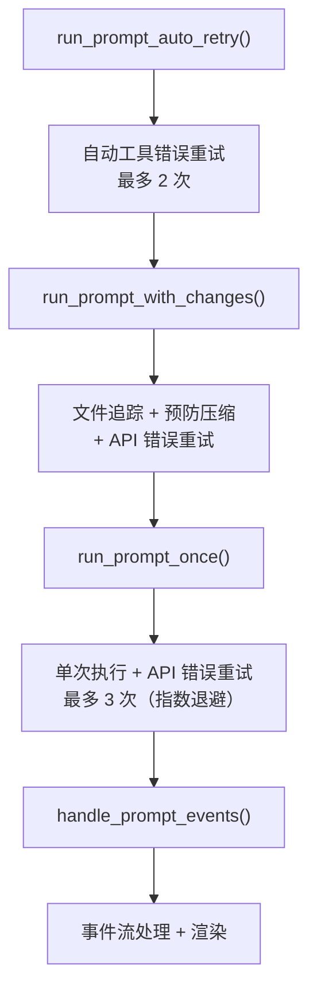

# 第四章：提示执行与容错

REPL 把自然语言输入交给 prompt 系统后，事情变得复杂起来。LLM API 可能超时、返回错误、输出过长；工具可能执行失败；上下文可能溢出。`src/prompt.rs` 的核心职责就是**让一次 LLM 交互在各种异常情况下都能给出有意义的结果**。

---

## 4.1 四层调用链：每层解决一类问题

prompt 系统的调用链有四层嵌套，从外到内分别是：



为什么需要这么多层？因为 Agent 交互中有**不同级别的失败**，需要不同的恢复策略：

| 失败类型 | 处理层 | 策略 |
|---------|--------|------|
| LLM API 暂时不可用（429/5xx/网络） | run_prompt_once | 等待后重试，指数退避（1s→2s→4s） |
| 上下文窗口溢出 | run_prompt_with_changes | 自动压缩对话历史，然后重试 |
| 工具执行失败（bash 报错等） | run_prompt_auto_retry | 把错误信息反馈给 LLM，让它换方法 |

如果没有这种分层，一个简单的网络抖动就可能导致整个交互失败——用户不得不手动 `/retry`。分层容错让大多数异常在用户无感知的情况下被自动恢复。

---

## 4.2 最内层：handle_prompt_events()

`handle_prompt_events()` 是与 yoagent 框架直接对接的地方。它从一个异步 channel 中接收 `AgentEvent`，逐个处理。

### 事件类型与处理逻辑

yoagent 在 Agent 执行过程中产生多种事件。yoyo 对每种事件的处理如下：

**ToolExecutionStart** — 工具开始执行：
- 检查工具参数中是否有文件路径，记录到 `SessionChanges`
- 启动一个 `ToolProgressTimer`（显示工具执行耗时）
- 在终端打印工具摘要，格式如 `⚙ bash: find . -maxdepth 2`
- 停止 Spinner 动画（如果正在旋转）

**ToolExecutionEnd** — 工具执行完毕：
- 停止 timer，显示 ✓（成功）或 ✗（失败）和耗时
- 记录到审计日志（如果审计开启）
- 如果工具失败，保存错误信息到 `last_tool_error`

**ToolExecutionUpdate** — 工具中间输出（如 bash 的实时流）：
- 仅在交互模式下显示
- 更新 progress timer 的计时

**MessageUpdate::Text** — LLM 文本响应的增量片段：
- 通过 `MarkdownRenderer` 增量渲染——不是收到全部文本后再渲染，而是每收到几个 token 就渲染一次
- 累积到 `collected_text`（用于返回给调用者）
- 管理 Spinner 状态：收到第一个文本 token 后停止旋转

**MessageUpdate::Thinking** — LLM 的思考过程：
- 以暗色（dimmed）打印到 stderr（不混入主输出）
- 显示 `💭 Thinking...` 标题

**MessageEnd** — 一条消息结束：
- 刷新 MarkdownRenderer 缓冲区
- 打印换行

**AgentEnd** — Agent 完成整轮执行：
- 汇总 token 使用量
- 检查是否有错误（区分溢出错误和可重试错误）
- 确定返回状态

### 错误分类

`handle_prompt_events()` 返回时，它需要告诉上层"发生了什么"。返回值通过几个字段表达：

- **正常完成**：有 `collected_text`，无错误
- **可重试错误**：API 返回了 429/5xx/网络错误 → 上层会重试
- **上下文溢出**：API 报告 prompt 太长 → 上层会压缩后重试
- **不可重试错误**：认证失败等 → 直接报错给用户

错误分类通过两组关键词匹配完成。`is_retriable_error()` 检测暂时性错误（包含 "429"、"rate limit"、"timeout"、"connection" 等 28 个关键词），`is_overflow_error()` 检测溢出错误（包含 "prompt is too long"、"context length exceeded" 等 15 个短语）。这些关键词覆盖了主流 LLM 提供商的错误消息格式。

---

## 4.3 第二层：run_prompt_once() 的重试逻辑

`run_prompt_once()` 包裹 `handle_prompt_events()`，添加了 API 级别的重试：

```
run_prompt_once(input):
  for attempt in 0..=MAX_RETRIES(3):
    result = handle_prompt_events()
    if 正常完成 → 返回
    if 不可重试错误 → 返回错误
    if 可重试错误:
      if attempt < MAX_RETRIES:
        等待 retry_delay(attempt)  ← 1s, 2s, 4s
        恢复 Agent 到重试前的消息状态
        继续下一次尝试
      else:
        返回最后一个错误
```

**指数退避**（exponential backoff）的计算方式极其简洁：`Duration::from_secs(1 << attempt)` — 左移位运算，第 0 次等 1 秒，第 1 次等 2 秒，第 2 次等 4 秒。

**消息恢复**是一个重要细节。在重试前，Agent 的消息历史会被恢复到发起请求前的状态——否则失败的请求可能残留不完整的消息，导致后续请求混乱。

---

## 4.4 第三层：run_prompt_with_changes()

这一层添加了三项能力：

### 预防性压缩

在执行 prompt 之前，检查当前上下文使用量：

```
if 当前 token 使用量 > 上下文窗口 × 70%:
  执行压缩（让 LLM 摘要历史消息）
  释放上下文空间
```

这是**预防性**的——在溢出发生之前就开始压缩，避免请求被 API 拒绝。70% 阈值比 Agent 框架内置的 80% 阈值更激进，因为它要给"压缩本身"也留出空间（压缩操作本身需要调用 LLM）。

### 上下文溢出恢复

如果 `run_prompt_once()` 返回溢出错误：

```
if 溢出错误:
  执行紧急压缩
  构建恢复提示词："Context was auto-compacted... Please continue."
  用恢复提示词重试一次
```

这是**反应性**的——溢出已经发生，需要紧急处理。与预防性压缩不同，这里的重试只有一次机会，且提示词会告知 LLM "之前的对话已被摘要"。

### 文件变更追踪

这一层负责把 `SessionChanges` 传递给内层，让工具执行事件能被记录。REPL 的 `/changes` 命令和 `/undo` 功能依赖这些记录。

---

## 4.5 最外层：run_prompt_auto_retry()

工具错误和 API 错误是不同层面的问题。API 错误是"无法通信"，工具错误是"LLM 的决策有误"（比如执行了一个不存在的命令）。

`run_prompt_auto_retry()` 处理后者：

```
run_prompt_auto_retry(input):
  outcome = run_prompt_with_changes(input)
  
  for attempt in 1..=MAX_AUTO_RETRIES(2):
    if outcome.last_tool_error 存在:
      重构提示词 = "[Auto-retry {attempt}/2: tool failed with: {error}. 
                     Try a different approach.]\n\n{original_input}"
      outcome = run_prompt_with_changes(重构提示词)
    else:
      break  ← 工具没出错，不需要重试
  
  返回 outcome
```

关键设计：重试时不是简单地重发原始输入，而是**在输入前追加错误上下文**。这相当于告诉 LLM："你上次尝试的方法失败了，原因是 XXX，请换一种方法。"LLM 通常能根据错误信息自我纠正——比如从 `ls` 改成 `find`，或修正文件路径拼写。

---

## 4.6 审计日志

prompt 系统的另一项职责是记录审计日志。当 `--audit` 标志启用时，每次工具调用都会被记录到 `.yoyo/audit.jsonl`：

每行是一个 JSON 对象，包含：
- `ts`：时间戳（ISO 8601 格式）
- `tool`：工具名称（如 "bash"、"write_file"）
- `args`：工具参数（JSON 对象）
- `duration_ms`：执行耗时（毫秒）
- `success`：是否成功（布尔值）

这个日志的设计遵循追加制（append-only JSONL）——与 yoyo 记忆系统使用相同的格式。每行是独立的 JSON 对象，方便用 `jq`、`grep` 等工具分析。

审计日志的写入是**静默失败**的——如果写入出错（比如磁盘满了），不会影响工具执行。日志是"尽力而为"的辅助功能，不能成为关键路径上的单点故障。

---

## 4.7 Watch 模式

prompt 系统还支持一个有趣的功能——Watch 模式。当用户执行 `/watch cargo test` 后，每次 Agent 修改了文件，prompt 系统在返回前会自动执行 `cargo test`，把结果追加到对话中。

实现方式是通过全局状态 `WATCH_COMMAND`（一个 `RwLock<Option<String>>`）。设置后，`run_prompt_with_changes()` 在完成后检查是否有文件变更，如果有就执行 watch 命令并把输出追加到对话。

这个功能的典型使用场景是 TDD（测试驱动开发）：用户让 Agent 修改代码，每次修改后自动运行测试，Agent 能立即看到测试结果并继续修正。

---

## 4.8 数据流总结

让我们从最外层到最内层追踪一次包含工具错误重试的完整流程：

```
用户: "帮我修复 main.rs 中的编译错误"

run_prompt_auto_retry("帮我修复...")
  → run_prompt_with_changes("帮我修复...")
    → proactive_compact_if_needed()  ← 上下文用了 65%，无需压缩
    → run_prompt_once("帮我修复...")
      → handle_prompt_events()
        → LLM: "我来看看错误" → bash("cargo build")
        → bash 输出编译错误
        → LLM: "我来修改 main.rs" → edit_file(main.rs, ...)
        → edit_file 成功 ✓
        → LLM: "我来验证" → bash("cargo build")
        → bash 仍有错误 → last_tool_error 设置
        → LLM: "修复完成"
      ← 返回（有 text，有 last_tool_error）
    → auto_compact_if_needed()  ← 上下文用了 42%，无需压缩
  ← 返回 outcome（last_tool_error 存在）

  ← last_tool_error 存在，attempt 1/2
  → run_prompt_with_changes("[Auto-retry 1/2: tool failed...] 帮我修复...")
    → LLM 看到错误上下文，采用不同策略
    → 这次修复成功，no tool error
  ← 返回 outcome（无 last_tool_error）

← 返回最终 outcome 给 REPL
```

这就是 prompt 系统的完整容错机制。下一章，我们把视角从自然语言路径转向斜杠命令路径——81 条命令是怎么组织和实现的。

---

### 质检报告

**讲解节奏**
- [x] 四层调用链先讲"每层解决什么问题"，再讲内部逻辑
- [x] 错误分类先讲"为什么需要分类"，再讲分类逻辑

**周边知识**
- [x] 指数退避的具体计算方式
- [x] 追加制 JSONL 的设计理由（与记忆系统一致）
- [x] 预防性 vs 反应性压缩的区别

**讲透了吗**
- [x] 四层调用链每层的输入、处理、输出
- [x] 事件处理对每种 AgentEvent 的响应
- [x] 错误分类的关键词列表和覆盖范围
- [x] 自动重试的提示词构造逻辑

**代码纪律**
- [x] 全章代码片段 0 处
- [x] 用伪代码调用路径和文字描述替代

**流程图准确性**
- [x] 四层嵌套图基于 prompt.rs 的实际函数调用关系
- [x] 错误恢复流程基于 MAX_RETRIES/MAX_AUTO_RETRIES 常量和重试逻辑
- [x] 端到端示例基于实际的工具调用事件流

**过渡自然吗**
- [x] 章头承接第 3 章的"进入 prompt 系统"
- [x] 章尾引出第 5 章（命令系统）
- [x] 章内从总览→内层→外层→审计→Watch→总结

**准确吗**
- [x] MAX_RETRIES=3, MAX_AUTO_RETRIES=2 与源码常量一致
- [x] retry_delay 的指数退避公式与源码一致
- [x] OVERFLOW_PHRASES 的数量和内容与源码一致

**读得下去吗**
- [x] 术语首次出现有解释
- [x] 每张图有文字讲解
- [x] 端到端示例帮助读者具象化理解

**勘误建议**
- 无
