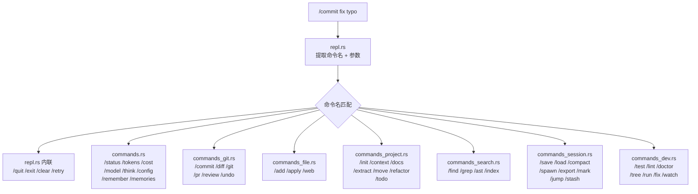

# 第五章：命令系统全解

第 3 章我们看到 REPL 把以 `/` 开头的输入路由到斜杠命令处理函数。这一章展开这个命令系统——81 条命令是怎么组织的、关键命令的内部机制是什么。

---

## 5.1 命令分发架构

命令处理分散在 7 个文件中，按职责划分：



简单命令（`/quit` 就是 `break`，`/clear` 就是清空消息）直接在 REPL 循环内处理。复杂命令路由到专门的处理函数。

---

## 5.2 Git 命令组：与版本控制的深度集成

Git 命令是使用频率最高的命令组之一。

### /commit：AI 生成提交消息

`/commit` 做了两件事：收集 `git diff --staged` 的内容，然后用**启发式规则**（不是 LLM）生成 conventional commit 格式的消息。

生成逻辑：
1. 分析变更文件的路径和内容
2. 判断 commit 类型（feat/fix/test/docs/chore）——根据文件扩展名和变更内容中的关键词
3. 提取 scope——从文件路径中取模块名（如 `src/commands_git.rs` → `git`）
4. 组合为 `type(scope): description`

如果用户提供了消息（`/commit fix typo`），直接用用户的消息。如果没提供，用自动生成的。

### /diff：带统计的差异显示

`/diff` 不只是执行 `git diff`——它先显示文件级摘要（哪些文件改了、各加了/删了几行），再显示完整差异。差异输出带 ANSI 颜色（绿色=新增，红色=删除），由 `colorize_diff()` 处理。

### /undo：文件级撤销

`/undo` 利用 `TurnHistory` 栈——第 3 章提到的状态变量。它弹出最近一轮的 `TurnSnapshot`，把快照中记录的每个文件恢复到修改前的状态。新创建的文件被删除。支持多级撤销（`/undo 3` 回退 3 轮）。

---

## 5.3 文件命令组：灵活的内容操作

### /add：把文件内容注入对话

`/add` 是把"项目上下文"喂给 LLM 的主要方式。它支持三种输入形式：

| 形式 | 示例 | 效果 |
|------|------|------|
| 完整文件 | `/add src/main.rs` | 读取整个文件 |
| 行范围 | `/add src/main.rs:10-20` | 只读第 10-20 行 |
| Glob 模式 | `/add src/*.rs tests/*.rs` | 展开匹配的所有文件 |

文件内容被格式化后追加到对话中，LLM 在后续回复中就能"看到"这些文件。图片文件（`.png`、`.jpg` 等）会被 base64 编码为多模态内容。

### /apply：差异补丁应用

`/apply` 接收 unified diff 格式的补丁文件，解析后应用到目标文件。支持 `--check` 干跑模式（只检查是否能成功应用，不实际修改）。

---

## 5.4 项目命令组：代码分析与重构

这是命令数量最多的组（3,791 行代码），包含 yoyo 的"项目理解"能力。

### /extract 和 /move：代码级重构

`/extract` 从一个文件中提取指定的函数/结构体/枚举定义，准备移到另一个文件。它能解析 Rust 语法，识别 `fn`、`struct`、`enum`、`trait`、`impl`、`type`、`const`、`static` 声明。

`/move` 在 `impl` 块之间移动方法。它解析 Rust 文件找到所有 `impl` 块，允许用户把一个方法从一个 `impl` 块移到另一个。

### /refactor：重构伞命令

`/refactor` 是一个路由命令，下面包含子命令：
- `/refactor rename old_name new_name`：项目级符号重命名
- `/refactor extract`：代码提取
- `/refactor move`：方法移动

符号重命名通过 `RenameSymbolTool` 实现——它扫描所有 Rust 文件，找到所有匹配的标识符，精确替换（不做字符串替换，避免误伤注释或字符串中的同名文本）。

### /todo：任务追踪

`/todo` 对接第 2 章介绍的 `TodoTool`，提供 REPL 层面的任务管理界面。在进化流水线中，TodoTool 让 Agent 能追踪正在进行的子任务。

---

## 5.5 搜索命令组：多层搜索

| 命令 | 搜索对象 | 实现方式 |
|------|---------|---------|
| `/find pattern` | 文件名 | 模糊匹配 + 得分排序 |
| `/grep pattern` | 文件内容 | 正则表达式逐行搜索 |
| `/ast pattern` | 语法结构 | ast-grep 工具（需要外部安装） |
| `/index` | 项目结构 | 构建完整文件索引 |
| `/search query` | 对话历史 | 关键词匹配 + 高亮 |

`/find` 的模糊匹配使用了一个简单但有效的评分算法——连续匹配的字符得更高分，路径越短得分越高。这让 `par` 能匹配到 `src/parser.rs` 而不是 `src/very/deep/parameter.rs`。

`/grep` 支持正则表达式和大小写切换（`-i`），输出格式为 `文件:行号:内容`，匹配部分高亮。

---

## 5.6 会话命令组：状态持久化

### /spawn：子代理委托

`/spawn` 启动一个 SubAgent（第 2 章 §2.5），在独立的上下文中执行任务。从用户角度：

```
/spawn "搜索所有使用了 unwrap() 的地方并评估风险"
  → 启动子代理 → 子代理独立搜索 → 返回结果摘要
  → 摘要被注入当前对话
```

`SpawnTracker` 跟踪所有子任务的状态（运行中/完成/失败），`/spawn status` 查看进度。

### /mark 和 /jump：对话书签

`/mark checkpoint1` 序列化当前消息历史为一个快照，`/jump checkpoint1` 恢复到那个点。这在探索性对话中很有用——"先试方案 A，不行就跳回来试方案 B"。

### /stash：对话暂存

类似 Git 的 stash 功能，`/stash push` 把当前对话保存到栈中，清空对话，`/stash pop` 恢复。`/stash list` 显示栈中的所有条目。

---

## 5.7 开发工具命令组

### /test 和 /lint：自动检测

这两个命令通过 `detect_project_type()` 自动识别项目类型（Rust/Python/JavaScript/Go/Java 等），然后运行对应的测试/lint 命令：

| 项目类型 | /test 执行 | /lint 执行 |
|---------|-----------|-----------|
| Rust | `cargo test` | `cargo clippy` |
| Python | `pytest` 或 `python -m unittest` | `ruff` 或 `flake8` |
| JavaScript | `npm test` | `npm run lint` 或 `eslint` |
| Go | `go test ./...` | `golangci-lint` |

### /doctor：环境诊断

`/doctor` 运行一系列环境检查并报告状态（PASS/FAIL/WARN）：Git 是否可用、API key 是否配置、项目文件是否存在等。

### /watch：持续测试

`/watch cargo test` 设置一个全局 watch 命令——此后每次 Agent 修改文件，都自动执行 `cargo test` 并把结果追加到对话。这是第 4 章 §4.7 介绍的 Watch 模式的 REPL 入口。

---

## 5.8 小结

81 条命令看似庞大，但按功能分组后结构清晰：Git 操作、文件操作、项目分析、搜索、会话管理、开发工具——每组解决一类开发工作流中的具体问题。

命令系统的设计哲学是**"能用 / 做的就不要让 LLM 做"**——`/commit`、`/diff`、`/test` 等命令直接执行，不消耗 LLM token，响应即时。只有需要理解力的任务（自然语言提问、代码审查）才走 LLM 路径。

下一章，我们看看 yoyo 如何管理与 LLM 对话的"窗口"——上下文窗口管理。

---

### 质检报告

**讲解节奏**
- [x] 先讲分发架构全景，再按组深入
- [x] 每个命令组选最有代表性的命令讲解

**周边知识**
- [x] conventional commit 格式在 /commit 处解释
- [x] unified diff 格式在 /apply 处提及
- [x] 模糊匹配得分算法在 /find 处说明

**讲透了吗**
- [x] 7 个命令组覆盖完整
- [x] 关键命令（/commit /add /extract /spawn /find）有实现细节
- [x] 命令表格覆盖完整

**代码纪律**
- [x] 全章代码片段 0 处

**流程图准确性**
- [x] 命令分发图基于 repl.rs 的实际路由逻辑
- [x] 项目类型检测基于 detect_project_type() 的实际实现

**过渡自然吗**
- [x] 章头承接第 3 章的命令路由
- [x] 章尾引出第 6 章
- [x] 章内按功能分组自然推进

**准确吗**
- [x] 命令数量（81 条）与 KNOWN_COMMANDS 常量一致
- [x] 文件职责划分与源码文件名一致
- [x] 项目类型检测的语言列表与源码一致

**读得下去吗**
- [x] 表格辅助快速查阅
- [x] 每组选代表性命令深入，避免面面俱到

**勘误建议**
- 无
