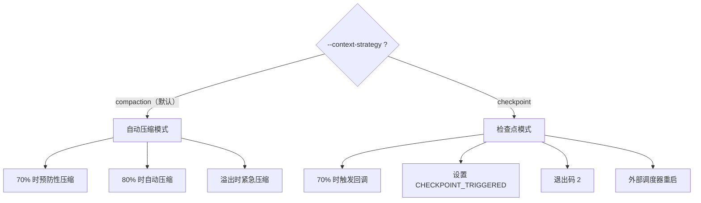

# 第六章：上下文窗口管理

第 4 章提到了 prompt 系统的双阈值压缩和上下文溢出恢复。这一章把上下文管理作为一个独立主题深入——这是 LLM 应用中最容易被低估、却最影响可靠性的设计决策之一。

---

## 6.1 问题：有限的记忆

LLM 的上下文窗口（context window）是它在一次对话中能"看到"的最大信息量。超出这个窗口，要么旧消息被截断（信息丢失），要么 API 直接报错（交互中断）。

yoyo 的默认上下文窗口是 200,000 token（约 15 万词英文或 7-8 万词中文）。听起来很大，但在实际使用中消耗得很快：

| 操作 | 典型 token 消耗 |
|------|----------------|
| 读一个 500 行的文件 | ~2,000 token |
| 一次 bash 命令输出 | 500-5,000 token |
| LLM 的一次回复 | 500-2,000 token |
| 工具定义（系统提示词的一部分） | ~3,000 token |

一次"阅读 3 个文件 → 修改 → 测试 → 修正"的交互可能消耗 20,000-30,000 token。长时间的 REPL 会话中，累积消耗很容易接近上限。

**不管理上下文，yoyo 在使用 10-20 轮后就会因溢出而崩溃。** 上下文管理的目标是让 yoyo 能无限期地持续工作。

---

## 6.2 两种策略

yoyo 通过 `--context-strategy` 参数提供两种上下文管理策略：



### 压缩模式（Compaction）

这是默认模式，适用于交互式使用。核心思想是：**当上下文快满时，让 LLM 把历史对话摘要为更短的版本。**

压缩在三个时机触发，形成三道防线：

**第一道：预防性压缩（70% 阈值）**。在每轮交互**开始前**检查。如果 token 使用量超过上下文窗口的 70%，先压缩再执行用户请求。这是 yoyo 自己在 `prompt.rs` 中实现的。

**第二道：yoagent 自动压缩（80% 阈值）**。`configure_agent()` 把 `context_window × 80%` 作为 `max_tokens` 传给 yoagent 的 `ContextConfig`。yoagent 在每轮工具调用循环中检查，超过阈值就执行内置的 `CompactionStrategy`。

**第三道：溢出紧急压缩**。如果 API 返回 "prompt too long" 错误（前两道防线都没挡住，可能因为单次工具输出特别大），`run_prompt_with_changes()` 紧急压缩然后重试一次。

为什么需要三道防线而不是一道？因为 token 计数不是精确的——yoyo 用启发式方法估算（基于字符数），实际的 token 计算在 API 服务端完成。70% 和 80% 阈值之间的 10% 缓冲就是为了容纳这个误差。第三道是最后的安全网。

### 压缩的代价

压缩不是免费的：

1. **信息损失**：摘要一定比原文更短，某些细节会丢失。LLM 可能忘记早期对话中提到的具体文件名或行号。
2. **一致性风险**：压缩后，LLM 可能"混淆"之前讨论的内容——比如把两个不同的修改方案合并成一个。
3. **额外开销**：压缩本身需要调用 LLM，消耗 token 和时间。

但不压缩的代价更大——会话直接中断，用户必须重新开始。**有损的延续好过无损的中断。**

### 检查点模式（Checkpoint）

检查点模式不做任何压缩——当上下文使用量达到 70% 时，Agent 停止执行，进程以退出码 2 退出。

这看起来是一个"更差"的策略（毕竟它直接中断了），但它有一个压缩模式没有的优势：**零信息损失**。所有对话内容完整保留在消息历史中，外部调度器可以启动新进程，带着之前的进度继续。

这正是进化流水线（第 7 章）使用检查点模式的原因。`evolve.sh` 检测到退出码 2 后：
1. 从 git 状态构建检查点摘要
2. 启动新的 Agent 进程，把检查点作为初始上下文
3. 新 Agent 在全新的上下文窗口中接续工作

检查点模式让 Agent 能完成超出单次上下文窗口的复杂任务——代价是需要外部协调，不适合交互式使用。

---

## 6.3 上下文使用量追踪

yoyo 在多处追踪和展示上下文使用量：

**全局原子变量 `EFFECTIVE_CONTEXT_TOKENS`**：在 `configure_agent()` 中设置，存储实际的上下文窗口大小（用户覆盖值或模型默认值）。

**`/tokens` 命令**：显示当前上下文使用情况，包括一个 ASCII 进度条：

```
Context: ████████░░░░░░░░░░░░ 42% (84,000 / 200,000 tokens)
Session: 12 turns, 15,340 total tokens, ~$0.04
```

这让用户能直观地看到"还剩多少空间"，决定是否需要手动 `/compact` 或开始新会话。

**usage 打印**：每轮交互后显示本轮的输入/输出 token 和累计值。格式为 `↳ 2.1K in / 1.5K out · session: 15.3K · ~$0.02`。

---

## 6.4 手动压缩：/compact 命令

除了自动压缩，用户可以主动执行 `/compact` 命令。它调用 `compact_agent()` 函数，该函数：

1. 获取当前消息列表的 token 估算
2. 调用 yoagent 的压缩 API
3. 对比压缩前后的消息数量和 token 数
4. 显示结果（如 "Compacted: 24 messages (12.5K tokens) → 3 messages (2.1K tokens)"）

手动压缩的典型使用场景：用户在一个长会话中完成了一个阶段（比如修复了一个 bug），准备开始新的话题时，先压缩掉之前的细节，为新话题腾出空间。

---

## 6.5 子代理的上下文隔离

第 2 章介绍了 `SubAgentTool`——它在独立的上下文中运行子代理。从上下文管理的角度，这是一种**空间换时间**的策略：

| 方案 | 上下文消耗 | 信息保留 |
|------|-----------|---------|
| 在主 Agent 中直接执行 | 高（所有中间结果留在上下文中） | 完整 |
| 委托给子代理 | 低（只有摘要返回主 Agent） | 部分（摘要） |

一个"搜索项目中所有 unwrap() 并评估风险"的任务可能需要读 17 个文件、检查数十个 unwrap 调用。如果在主 Agent 中执行，这些文件内容全部进入上下文（可能 50,000+ token）。委托给子代理后，主 Agent 只收到一段 500 token 的摘要。

这就是为什么 `/spawn` 命令对长会话很重要——它是除了压缩之外的另一种上下文管理手段。

---

## 6.6 小结：层次化的上下文管理

yoyo 的上下文管理不是单一机制，而是多个层次协同工作：

```
第 1 层: 工具输出截断（TruncatingTool, 30K/15K 字符）
  — 防止单次工具调用消耗过多上下文
第 2 层: 子代理隔离（SubAgentTool）
  — 复杂任务在独立上下文中完成，只返回摘要
第 3 层: 预防性压缩（70% 阈值）
  — 在溢出前主动压缩
第 4 层: yoagent 自动压缩（80% 阈值）
  — 框架级别的兜底
第 5 层: 溢出紧急压缩
  — 最后的安全网
第 6 层: 检查点退出（进化流水线专用）
  — 零损失的进程级重启
```

每一层都假设"上面的层可能不够"，从而提供递进的保护。这种纵深防御（defense in depth）确保了 yoyo 在各种使用模式下都不会因为上下文溢出而崩溃。

这也是 yoyo 作为进化系统的实践智慧之一——上下文管理从 Day 2 的单一 80% 阈值，一路演进到今天的六层架构，每一层都是在实际使用中遇到问题后加上的。

---

### 质检报告

**讲解节奏**
- [x] 先讲"为什么需要管理"（有限的记忆），再讲"怎么管理"
- [x] 两种策略先对比，再分别深入

**周边知识**
- [x] token 计数不精确的原因（启发式 vs 服务端）
- [x] "有损延续好过无损中断"的权衡
- [x] 纵深防御的安全概念

**讲透了吗**
- [x] 三道自动压缩防线的时机和阈值
- [x] 压缩的代价分析
- [x] 检查点模式与进化流水线的配合
- [x] 六层上下文管理的完整层次

**代码纪律**
- [x] 全章代码片段 0 处

**流程图准确性**
- [x] 双策略图基于 ContextStrategy 枚举和 configure_agent() 逻辑
- [x] 阈值数值基于 cli.rs 常量（70%/80%）

**过渡自然吗**
- [x] 章头承接第 4 章提到的双阈值压缩
- [x] 章尾总结为六层架构
- [x] 章内从问题→策略→追踪→手动→隔离→总结

**准确吗**
- [x] 200K 默认上下文窗口与 DEFAULT_CONTEXT_TOKENS 一致
- [x] 70%/80% 阈值与 PROACTIVE_COMPACT_THRESHOLD/AUTO_COMPACT_THRESHOLD 一致
- [x] 退出码 2 与 CHECKPOINT_TRIGGERED 机制一致

**读得下去吗**
- [x] token 消耗表格帮助具象化理解
- [x] 每张图有文字讲解

**勘误建议**
- 无
