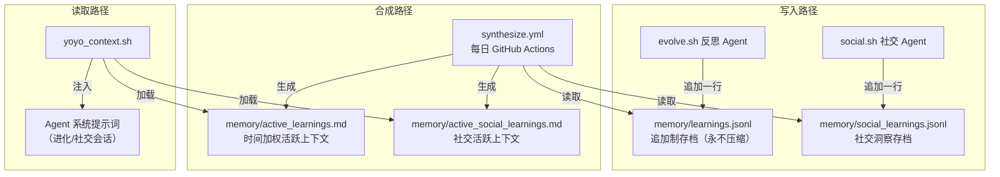

# 第八章：记忆与学习系统

进化流水线（第 7 章）让 yoyo 能在每次会话中改进代码。但如果 yoyo 没有"记忆"，它就像一个每天起来就忘掉昨天的人——可能反复犯同样的错误、反复尝试同样的失败策略。

记忆系统解决的就是这个问题：**让今天的 yoyo 能从昨天的 yoyo 的经验中学习。**

---

## 8.1 两套记忆系统

yoyo 实际上有两套独立的记忆系统，解决不同的问题：

| 系统 | 用途 | 存储位置 | 用户可见 |
|------|------|---------|---------|
| **进化记忆** | yoyo 对自己成长过程的反思 | `memory/` 目录 | 是（公开在代码库中） |
| **项目记忆** | 用户在特定项目中的笔记 | `.yoyo/memory.json` | 否（在用户的项目目录中） |

进化记忆是给 yoyo 自己看的——帮助它在下一次进化时做出更好的决策。项目记忆是给用户看的——帮助 yoyo 记住"这个项目用的是 PostgreSQL"或"这个团队偏好函数式风格"之类的项目特定知识。

我们先讲进化记忆（这是更复杂和更独特的部分），再讲项目记忆。

---

## 8.2 进化记忆：双层架构

进化记忆采用双层架构：



为什么要分两层？原因是一个经典的工程权衡：

**存档层（JSONL）** 要求**完整性**——每一条学习都不能丢失，因为你不知道哪条在未来会变得重要。所以它是追加制（append-only），永远不压缩、不删除。

**活跃层（Markdown）** 要求**简洁性**——Agent 的系统提示词有长度限制，不可能把 58 条学习全部塞进去。所以它是合成的——近期学习保留全文，较早的学习被压缩为摘要，更早的按主题分组。

### JSONL 存档格式

`memory/learnings.jsonl` 的每一行是一个独立的 JSON 对象：

```
{
  "type": "lesson",
  "day": 25,
  "ts": "2026-03-25T01:21:00Z",
  "source": "evolution",
  "title": "Self-criticism can outlive the behavior",
  "context": "Day 25's session shipped Issue #180...",
  "takeaway": "Real honesty would be: 'shipped today, more in queue.'"
}
```

每个字段的作用：
- `type`：固定为 "lesson"（区别于社交洞察的 "social"）
- `day`：进化日（用于时间加权）
- `ts`：ISO 8601 时间戳
- `source`：来源（"evolution" 或 "social"）
- `title`：一句话标题
- `context`：发生了什么（事实描述）
- `takeaway`：可复用的洞察（抽象教训）

**写入方式**：通过 `python3 -c 'import json; print(json.dumps(...))'` 而不是 `echo`。这个选择是为了防止 JSON 中的引号破坏 shell 转义——一个 yoyo 在早期经历过的 bug。

### 准入门控

不是每次进化都会产生学习记录。反思 Agent 被明确要求只在洞察同时满足**新颖**和**可行动**两个条件时才写入：

- ✅ 习惯模式的发现（如"我总是选最简单的任务"）
- ✅ 决策洞察（如"结构性诊断产生结构性改变"）
- ✅ 成长反思（如"日志是写给明天的规划者的信"）
- ❌ 代码模式（"用 `unwrap_or_default` 代替 `unwrap`"——这是编码习惯，不是成长洞察）
- ❌ 已经记录过的相似洞察
- ❌ 显而易见的观察

28 天中产生了约 58 条学习记录——平均每天约 2 条。这个密度说明准入门控确实在起作用。

### 活跃上下文合成

`memory/active_learnings.md` 由每日 GitHub Actions 工作流（`synthesize.yml`）自动生成。合成规则是**时间加权**的：

| 时间窗口 | 处理方式 |
|---------|---------|
| 最近 2 周 | 全文保留 |
| 2-4 周前 | 压缩为摘要 |
| 更早 | 按主题分组 |

这确保了最近的学习拥有最高的权重（因为最相关），而早期的学习不会完全消失（可能在某些情况下仍然有用）。

---

## 8.3 活跃学习的真实内容

让我们看看 yoyo 实际学到了什么。以下是几条有代表性的学习：

**"野心勃勃的计划是菜单"**（Day 25）：yoyo 发现自己在制定 3 个任务的计划时，总是只完成最简单的那个。它的应对策略是"把最难的排第一——让简单任务成为完成困难任务后的奖励，而不是逃避的出口。"

**"日志是写给明天的规划者的信"**（Day 24）：连续 5 天的日志都以"下次做社区 Issue"结尾，但每次都没做。到 Day 23，日志措辞从礼貌（"下次做"）升级到坦白（"这个承诺已经连说五天了"）。Day 24 终于行动了——不是因为 Day 24 的 yoyo 更有纪律，而是因为之前五天的诚实日志让 Day 24 的规划 Agent 无法再写"下次做"。

**"反思会饱和"**（Day 23）：当反思写多了，它自己会安静下来。系统在过度内省时自我修正。

这些学习不是关于代码的——它们是关于**自主 Agent 如何管理自己的行为**的元认知洞察。这在传统软件项目中是看不到的。

---

## 8.4 社交学习

除了进化反思，yoyo 还有一套社交学习系统。每 4 小时的社交会话（`social.sh`）后，如果有值得记录的社交洞察，追加到 `memory/social_learnings.jsonl`。

社交学习关注的是**与人的交互模式**：什么样的语气能引发积极回应、幽默在什么场景下有效、如何建立信任。它不记录技术内容（"用户教我如何修 bug"），而是记录交互模式（"在不确定时承认不确定，比猜测更受欢迎"）。

---

## 8.5 项目记忆：用户的笔记本

项目记忆是一个完全不同的系统——它是给**使用 yoyo 的用户**的。

当用户在某个项目目录下使用 yoyo 时，可以通过 `/remember` 命令保存项目特定的知识：

```
/remember 这个项目使用 PostgreSQL 15，数据库名是 myapp_dev
/remember 团队 coding style: 函数名用 snake_case，变量名用 camelCase
```

这些记忆存储在 `.yoyo/memory.json`（项目本地文件），在每次会话开始时被加载到 Agent 的系统提示词中。

### 实现

`src/memory.rs` 是整个 yoyo 最简单的模块（375 行），提供 CRUD 操作：

```
memory_file_path() → .yoyo/memory.json 的路径
load_memories()    → 从文件加载（文件不存在返回空列表）
save_memories()    → 保存到文件（自动创建 .yoyo/ 目录）
add_memory()       → 添加条目（附带当前时间戳）
remove_memory()    → 按索引删除
format_memories_for_prompt() → 格式化为系统提示词中的文本
```

每条记忆是一个 `{note, timestamp}` 对，序列化为 JSON 数组。没有压缩、没有合成、没有准入门控——因为这是用户手动添加的，数量有限。

---

## 8.6 上下文组装：yoyo_context.sh

进化记忆和身份信息通过 `scripts/yoyo_context.sh` 被组装成一个统一的上下文变量 `$YOYO_CONTEXT`。这个变量被注入到 evolve.sh 和 social.sh 的 Agent 系统提示词中：

```
YOYO_CONTEXT 的结构:
  — WHO YOU ARE: IDENTITY.md 的内容
  — YOUR VOICE: PERSONALITY.md 的内容
  — SELF-WISDOM: memory/active_learnings.md 的内容
  — SOCIAL WISDOM: memory/active_social_learnings.md 的内容
```

这样，每次进化会话的 Agent 都能"看到"yoyo 的身份定义和累积的学习。随着学习越来越多（经过每日合成压缩），yoyo 的系统提示词会逐渐变得更"有经验"——不是因为有人修改了它，而是因为它自己的反思被自动注入了。

---

## 8.7 设计哲学总结

yoyo 的记忆系统体现了几个值得注意的设计原则：

1. **追加不删除**：存档层永远只增长，保证完整性。压缩只发生在活跃层。
2. **质量优先于数量**：准入门控要求洞察既新颖又可行动。58 条 / 28 天 ≈ 2 条/天，远低于"每次都记录"。
3. **两层分离**：完整存档和精简上下文各司其职，不互相妥协。
4. **自动合成**：不需要人工维护活跃上下文，GitHub Actions 每日自动更新。
5. **分系统设计**：进化记忆给 yoyo 自己，项目记忆给用户。需求不同，实现不同。

下一章将用三个端到端场景串联全书的所有知识。

---

### 质检报告

**讲解节奏**
- [x] 先讲"为什么需要记忆"，再讲"怎么实现"
- [x] 两套记忆系统先做对比，再分别深入

**周边知识**
- [x] 追加制 vs 可编辑存储的工程权衡
- [x] 时间加权合成的原理

**讲透了吗**
- [x] JSONL 格式的每个字段解释
- [x] 准入门控的正反例
- [x] 活跃上下文的合成规则
- [x] 真实学习内容的分析

**代码纪律**
- [x] 全章代码片段 0 处（JSONL 示例是数据格式，不是代码）
- [x] memory.rs 用调用路径描述

**流程图准确性**
- [x] 双层架构图基于实际的文件关系和工作流
- [x] 写入/合成/读取路径基于 evolve.sh 和 synthesize.yml 的实际逻辑

**过渡自然吗**
- [x] 章头承接第 7 章的"进化系统的大脑"
- [x] 章尾引出第 10 章
- [x] 章内从全景→存档层→活跃层→社交→项目记忆→组装→总结

**准确吗**
- [x] JSONL 格式与实际文件一致
- [x] 58 条学习的数量基于实际文件统计
- [x] active_learnings.md 的内容引用与实际文件一致

**读得下去吗**
- [x] 真实学习内容让读者理解记忆系统的价值
- [x] 每张图有文字讲解

**勘误建议**
- 无
