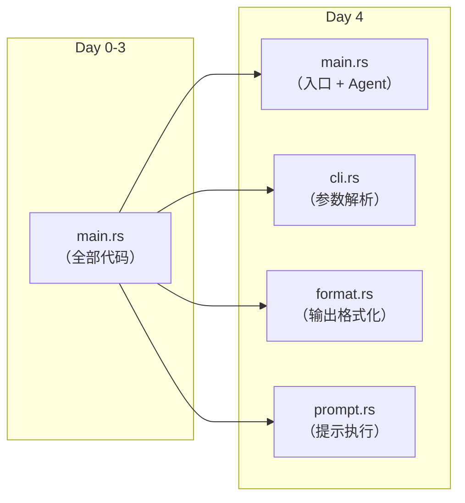
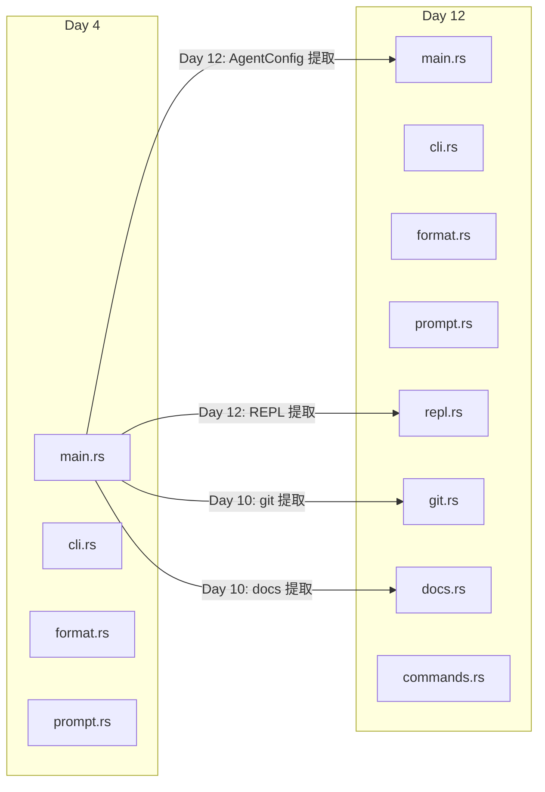

# 第九章：项目演进史 — 从 200 行到 35,000 行

这一章不讲代码怎么运行——讲**代码怎么长成现在这个样子**。

通过阅读 796 条 commit 记录，我们可以还原 yoyo 从最初的实验原型到一个功能完整的编程助手的成长过程。理解这个过程，比只看最终形态更能帮你理解每个设计决策背后的"为什么"。

---

## 9.1 四个时期

yoyo 的 28 天进化可以划分为四个时期：

| 时期 | 天数 | 提交数 | 核心主题 |
|------|------|--------|---------|
| **原型期** | Day 1–4 | ~80 | 从单文件到可用的 CLI |
| **基础设施期** | Day 5–12 | ~200 | 模块化、测试、核心命令 |
| **成熟期** | Day 13–20 | ~250 | 社区功能、发布、多 Provider |
| **精炼期** | Day 21–28 | ~260 | 性能优化、上下文管理、子代理 |

每个时期结束时的 yoyo，和开始时是完全不同的系统。让我们看看每个阶段发生了什么。

---

## 9.2 原型期（Day 1–4）："能跑就行"

### 初始状态

Day 0（人类的唯一一次提交）创建了项目骨架：

- `src/main.rs`：约 200 行，包含 Agent 构建、基本 REPL、几个斜杠命令
- `scripts/evolve.sh`：进化流水线的雏形
- `IDENTITY.md` 和 `PERSONALITY.md`：身份定义
- 依赖 yoagent 框架

这是一个最小可运行的 Agent——能连接 Anthropic API、在终端交互、调用 yoagent 的默认工具。

### Day 1–2：核心能力涌现

```
Day 1 提交摘要：
  — --help / --version 标志 + 测试（不再 panic 退出）
  — 管道输入模式（echo "prompt" | yoyo）
  — Git 分支显示在 REPL 提示符
  — /status 命令
  — Ctrl+C 优雅中断
  — Token 累计统计
  — extract build_agent() 消除重复代码

Day 2 提交摘要：
  — 多行输入（反斜杠续行 + 代码围栏）
  — API 错误显示给用户（而不是静默失败）
  — /save 和 /load 会话持久化
  — --prompt/-p 单次模式
  — /undo 撤销命令
  — --continue 恢复上次会话
  — 自动压缩（上下文 80% 时触发）
  — /compact 手动压缩
  — --thinking 思考模式
```

两天之内，yoyo 从"能对话"变成了"能作为开发工具使用"。注意几个关键的**自我发现**：

- Day 1 就发现了代码重复（`build_agent()` 出现在三个地方），提取为函数。这是 yoyo 第一次重构自己的代码。
- Day 2 发现了用户看不到错误（API 返回错误时程序静默），主动暴露错误信息。

### Day 3–4：第一次模块分裂

到 Day 4，`main.rs` 已经膨胀到不可管理的程度。yoyo 做了第一次架构决策：

```
Day 4 关键提交：
  split main.rs into modules (cli, format, prompt)
```

`main.rs` 被拆分为 `cli.rs`（参数解析）、`format.rs`（输出格式化）、`prompt.rs`（提示执行）。这是项目从单文件走向模块化的转折点。



同时这个时期还移除了 ROADMAP.md——yoyo 决定不用静态路线图，而是每次进化时动态评估优先级。这反映了一个早期就确立的哲学：**自主判断优先级，而不是按预定清单执行。**

---

## 9.3 基础设施期（Day 5–12）："打地基"

### Day 5–9：命令系统爆发

这个阶段 yoyo 密集地添加命令——几乎每次进化都新增 2-3 个斜杠命令：

| 天 | 新增命令 |
|----|---------|
| 7 | /run（执行 shell）、/search（搜索历史）、/pr（PR 交互） |
| 8 | /commit（AI 生成提交消息）、/git（Git 快捷操作）、Tab 补全、Markdown 渲染 |
| 9 | --openapi（加载 OpenAPI 规范）、YOYO.md 成为主上下文文件、变异测试 |

**rustyline 集成**（Day 8）是这个阶段的关键升级——之前 yoyo 使用原始的 stdin 读取，没有行编辑、没有历史、没有补全。rustyline 让交互体验从"能用"跃升到"好用"。

**变异测试**（Day 9）的引入也值得注意。变异测试（mutation testing）是一种高级测试质量检测方法——自动修改源码（"变异体"），检查测试是否能捕获这些修改。如果测试没发现一个变异体，说明测试覆盖有漏洞。yoyo 在只有 Day 9 就引入了这个工具，说明它很早就意识到测试质量的重要性。

### Day 10–12：模块化浪潮

代码量持续增长，yoyo 开始第二轮模块提取：

```
Day 10: Extract git module from main.rs ("octopus untangles its tentacles 🐙")
Day 10: Extract docs lookup into src/docs.rs
Day 12: Extract AgentConfig struct to eliminate build_agent duplication
Day 12: Extract REPL loop into its own module
```

到 Day 12 结束，源码从 4 个文件扩展到 8 个文件，每个模块有清晰的职责。同时新增了 `/find`（模糊搜索）、`/test`（自动检测并运行测试）、`/lint`（自动检测并运行 linter）、`/spawn`（子代理委托）等重要命令。



---

## 9.4 成熟期（Day 13–20）："面向用户"

### Day 13–16：社区功能与多 Provider

这个阶段 yoyo 的关注点从"自我改进"转向"为用户服务"：

- Day 13：`/pr create`（AI 生成 PR 描述）、`/review`（代码审查）、`/init`（项目引导）
- Day 14：Tab 补全增强（参数感知）、`/mark` 和 `/jump`（会话书签）
- Day 15：`/provider` 切换、用户确认提示（写操作前要求 y/n）
- Day 16：自动保存会话、CHANGELOG 创建、yoagent 升级到 0.7

**用户确认提示**（Day 15）是一个里程碑式的安全改进。之前 yoyo 的工具是"直接执行"的——LLM 说写文件就写文件。Day 15 引入了 `ConfirmTool` 包装层，要求用户在文件写操作前确认。这在第 2 章讲过的三层包装架构中是最后添加的一层。

### Day 17–20：发布与多模态

- Day 17-19：准备 crates.io 发布（改包名为 `yoyo-agent`、版本管理、release 技能）
- Day 19：成功发布 v0.1.0 到 crates.io
- Day 20：图片支持（`--image`）、上下文溢出自动恢复、`/help <command>` 详细帮助

**记忆系统重设计**发生在这个时期。早期的 LEARNINGS.md 是一个扁平文本文件，Day 18-19 期间被重构为双层架构：JSONL 追加制存档 + 活跃上下文 Markdown。这个设计在第 8 章详细讨论。

---

## 9.5 精炼期（Day 21–28）："打磨细节"

### Day 21–24：性能与体验

这个阶段不再追求"新功能"，而是深入打磨已有功能：

- Day 21：`run_git()` 工具函数提取（消除 29 处裸 git 调用）
- Day 22：完成 format.rs 分裂（移除 3,000+ 行重复代码）、`/extract` 和 `/move` 命令
- Day 23：流式输出延迟优化（数字-单词和连字符模式的冲刷策略）、系统提示词配置
- Day 24：审计日志、预防性上下文压缩、终端铃声通知

**流式输出优化**是一个有趣的例子。Day 22 有人报告说 yoyo 的输出"感觉比 Claude Code 慢"。yoyo 调查后发现原因不是 API 慢，而是自己的输出缓冲策略过于保守——为了避免不完整的 Markdown 渲染，它等待积累更多 token 后才刷新。Day 23 它优化了冲刷策略，特别处理了"数字后跟单词"和"连字符后跟单词"的模式，让输出在保持渲染正确性的同时更早地显示。

### Day 25–28：架构升级

- Day 25：集成 yoagent 的内置上下文管理、`--context-strategy` 标志、SubAgentTool、AskUserTool、MiniMax provider
- Day 26：TodoTool、flaky test 修复、流错误诊断改进
- Day 27：配置路径修复（支持 `~/.yoyo.toml`）
- Day 28：v0.1.4 版本发布

**SubAgentTool 的集成**（Day 25）是架构上最重要的变化。之前 yoyo 只有一个 Agent 实例，所有操作共享同一个上下文窗口。SubAgentTool 让 yoyo 能把复杂任务委托给独立的子代理，每个子代理有自己的上下文——大幅提升了处理复杂任务的能力。

---

## 9.6 演进模式：几个值得注意的规律

回顾 28 天的 commit 历史，有几个反复出现的模式：

### "膨胀-分裂"循环

文件不断增长，直到达到某个临界点，然后被拆分。这个循环发生了三次：

1. Day 4：main.rs → cli.rs + format.rs + prompt.rs
2. Day 10-12：main.rs → git.rs + docs.rs + repl.rs + commands.rs
3. Day 22：format.rs 清理（移除 3,000+ 行重复代码）

### "先用再优化"

几乎每个功能都遵循这个模式：先用最简单的方式实现，能工作就提交，等遇到问题再优化。比如：

- 会话保存：Day 2 的 `/save` + `/load` → Day 16 的自动保存
- 输出缓冲：Day 8 的基本 Markdown 渲染 → Day 22-23 的流式优化
- 上下文管理：Day 2 的 80% 自动压缩 → Day 24 的 70% 预防性压缩 → Day 25 的 yoagent 框架集成

### "社区反馈驱动"

从 Day 13 开始，很多改进来自 GitHub Issue。yoyo 不只是自己找问题——它开始响应真实用户的反馈。Issue #137（流式输出慢）、Issue #138（图片不可见）、Issue #147（性能）、Issue #154（文档）等都直接推动了具体改进。

### "失败也是进步"

不是每次进化都成功。Journal 中记录了多次"什么都没改"或"回滚了修改"的会话。但每次失败都会产生一个 `agent-self` Issue 和一条学习记录，为下次尝试提供上下文。yoyo 的进化不是线性上升——更像是一个有噪音的上升趋势。

---

## 9.7 数字看演进

| 指标 | Day 1 | Day 12 | Day 20 | Day 28 |
|------|-------|--------|--------|--------|
| Rust 源文件数 | 1 | 8 | 12 | 17 |
| 代码行数 | ~200 | ~8,000 | ~20,000 | ~35,000 |
| 测试数量 | 0 | ~200 | ~800 | 1,346 |
| 斜杠命令数 | ~5 | ~30 | ~55 | 81 |
| 支持 Provider 数 | 1 | 2 | 8 | 13 |

这些数字背后是 796 次提交、约 80 次进化会话、无数次构建/测试/回滚循环。每一行代码都是 yoyo 自己写的、自己测试的、自己决定提交的。

下一章（端到端追踪）会用三个完整场景串联全书的所有知识。

---

### 质检报告

**讲解节奏**
- [x] 先讲时期划分全貌，再逐期展开
- [x] 每个时期先讲"架构长什么样"，再讲"做了什么改变"

**周边知识**
- [x] 变异测试的概念在首次出现时解释
- [x] 膨胀-分裂循环在多个系统中的普遍性

**讲透了吗**
- [x] 四个时期各有 2-3 个关键转折点深入分析
- [x] 演进模式从具体事例中抽象出规律
- [x] 数字对比给出可量化的增长轨迹

**代码纪律**
- [x] 全章代码片段 0 处
- [x] 用 commit 摘要列表代替代码

**流程图准确性**
- [x] 模块分裂图基于实际的 commit 记录
- [x] 时间线和数字基于 git log 统计

**过渡自然吗**
- [x] 章头从"代码怎么长成的"切入
- [x] 章尾引出第 10 章
- [x] 章内按时间线自然推进，模式分析作为总结

**准确吗**
- [x] 所有 commit 摘要来自 git log
- [x] 天数和功能对应关系经过验证
- [x] 数字指标基于实际统计

**读得下去吗**
- [x] 叙事体+表格+时间线，混合使用
- [x] 每张图有文字讲解

**勘误建议**
- Day 1-4 精确代码行数是估计值，标记为"约"
